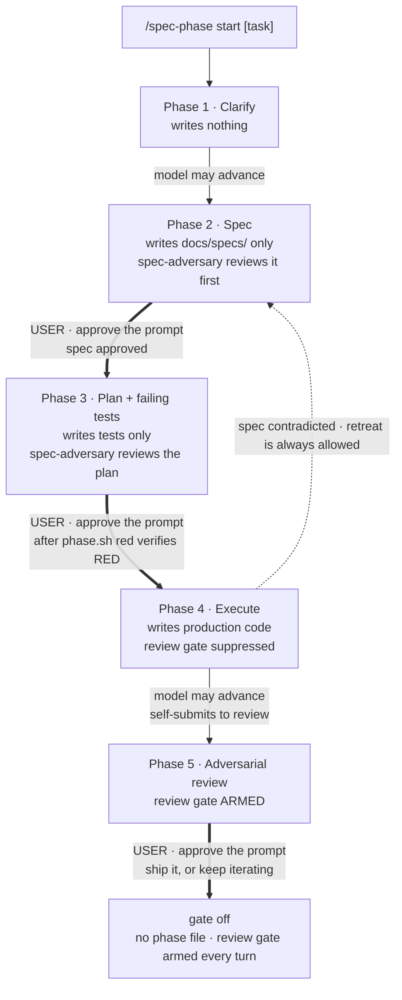
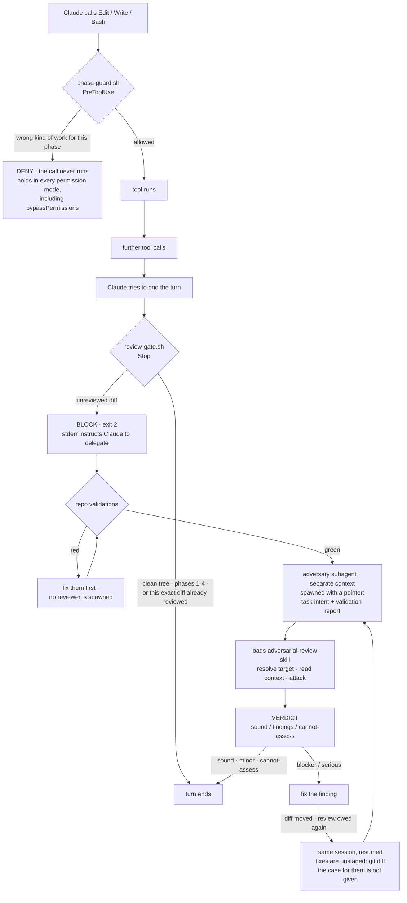

# spec-gate

A Claude Code review gate and spec-driven workflow. Two composable layers that
move oversight of AI-written code from *approving each tool call* to *reviewing
each outcome*:

1. **A review gate** — a `Stop` hook that refuses to end a turn on a diff that
   hasn't been through adversarial review, plus an `adversary` subagent that does
   the reviewing in an isolated context. What that subagent actually does is an
   `adversarial-review` skill it loads for itself, so the spawn is a pointer and
   not a briefing. The skill also stands alone: `/adversarial-review` on any diff,
   workflow or no workflow.
2. **A phase gate** — a `PreToolUse` hook enforcing a five-phase workflow
   (clarify → spec → plan + failing tests → execute → review), where production
   code is blocked *at the tool level* until a spec exists and the user has
   approved it. A second subagent, `spec-adversary`, attacks the spec and the
   plan on paper before that approval is asked for.

Design premise: **prompts raise the average, hooks raise the minimum.** Anything
that must always happen is a hook. Anything needing judgment is a prompt. The
value is in knowing which is which — see [What is actually
enforced](#what-is-actually-enforced).

This directory is the source of truth for the toolkit. It is *installed into*
a separate target repo — the one whose code you want gated.

## Layout

The directory mirrors the `.claude/` layout it installs into, so the three
directories copy across recursively with no per-file renaming — and that same
layout is what the plugin format expects, so one tree serves both installs:

```
spec-gate/
├── README.md                        docs — not installed
├── test.sh                          regression suite — not installed
├── settings.json                    → .claude/settings.json  (MERGE, see below)
│                                    (.claude/spec-gate-test-cmd is written per
│                                     repo at install; see RED verification)
├── .claude-plugin/
│   └── plugin.json                  the plugin manifest — metadata only
├── hooks/
│   ├── hooks.json                   the plugin's copy of the wiring in
│   │                                settings.json, via ${CLAUDE_PLUGIN_ROOT};
│   │                                test.sh pins the two together
│   ├── review-gate.sh               → .claude/hooks/   Stop hook
│   ├── phase-guard.sh               → .claude/hooks/   PreToolUse hook
│   ├── approval-receipt.sh          → .claude/hooks/   PostToolUse hook
│   ├── review-bookmark.sh           → .claude/hooks/   SubagentStart/Stop hook
│   ├── phase-policy.sh              → .claude/hooks/   shared policy, sourced
│   ├── phase.sh                     → .claude/hooks/   phase state CLI, and the
│   │                                   SessionStart hook (`phase.sh brief`)
│   ├── phase-shim.sh                → .claude/hooks/phase.sh on a PLUGIN install:
│   │                                   a pointer to the central copy, no policy
│   ├── cursor-guard.sh              → .claude/hooks/   Cursor adapter
│   └── cursor-stop.sh               → .claude/hooks/   Cursor adapter
├── agents/
│   ├── adversary.md                 → .claude/agents/   judges the diff — a
│   │                                   pointer; its procedure is the skill below
│   └── spec-adversary.md            → .claude/agents/   judges the spec + plan
├── skills/                          → .claude/skills/  (and .cursor/skills/, in part)
│   ├── spec-driven/
│   │   ├── SKILL.md                 the workflow
│   │   └── references/              read on demand, not on every run
│   │       ├── reviewer-sessions.md why reuse, and the bookmark's failure history
│   │       ├── slicing.md           only when a task is too big for one review
│   │       └── validation.md        how to find what a repo gates on
│   ├── adversarial-review/
│   │   ├── SKILL.md                 the reviewer's procedure
│   │   └── scripts/
│   │       └── resolve-review-target.sh   working tree, or branch against its base
│   ├── spec-phase/SKILL.md          user-only phase control
│   └── spec-gate-install/SKILL.md   user-only per-project setup
└── cursor/                          for Cursor instead of / alongside Claude Code
    ├── hooks.json                   → .cursor/hooks.json
    └── agents/*.md                  → .cursor/agents/
```

The skills follow the standard skill layout — `SKILL.md` for what is needed every
run, `references/` for what is needed sometimes, `scripts/` for what should be
executed rather than transcribed. Two of those directories earn their place for
reasons specific to this toolkit:

- **`spec-driven/references/`** exists because the workflow's *rules* are short and
  its *reasons* are long, and the reasons are what stop a rule being routed around.
  Keeping both inline put the file past the point where the parts that run on every
  task compete with the parts that run occasionally. Each pointer says when to read
  it, and `test.sh` checks that every one of them resolves — file **and** anchor,
  since a renamed heading leaves a link that silently lands at the top of a page.
- **`adversarial-review/scripts/`** exists because trunk resolution was a fenced
  block the reviewer retyped, and a procedure that has to be retyped to run is one
  that drifts from the version the tests cover. The suite now executes the shipped
  file. The prose that survives in `SKILL.md` explains *why* each guard is there,
  which is the part a reviewer needs and a script cannot carry.

`phase-policy.sh` is sourced by both hooks rather than executed. It holds the
one copy of what each phase permits and how the working tree is fingerprinted.
Both enforcement layers have to agree on those rules exactly; two
implementations would drift, and a gate that disagrees with itself is worse than
none. It is also the file to edit when tuning test-path patterns.

The scripts are committed with the executable bit set, so `cp -R` preserves it
and no `chmod` step is needed.

## Requirements

- A git repo. Both Stop-hook jobs fingerprint the working tree with
  `git diff HEAD`, `git ls-files` and `git hash-object`; outside a work tree the
  hooks exit silently.
- **Either `jq` or `python3`** — the hooks detect which is available. The
  optional `SubagentStop` review log in `settings.json` is the one jq-only piece;
  drop that block if you have neither. (`test.sh` additionally wants `python3`, to
  build hook payloads with quoting intact.)
- `bash`, not `sh`. The hooks use arrays, `<<<`, and process substitution.

## Install

Two ways in. The plugin install is shorter; the manual install is the one
`test.sh` exercises, and the one to reach for if you want to edit the hooks in
place.

**Driving this from Cursor? Use the [manual install](#by-hand).** The plugin
install serves Claude Code only, and layering Cursor's hooks on top of it blocks
every tool call in the repo — see [Running under
Cursor](#running-under-cursor).

### As a plugin

```
/plugin marketplace add Vavly/skills
/plugin install spec-gate@vavly-skills
```

Both lines, in that order. `Marketplace "vavly-skills" not found` means only the
second one ran — the marketplace is added by repo (`Vavly/skills`) and installed
from by name (`vavly-skills`), and the error names only the latter. Outside an
interactive session the same two steps are `claude plugin marketplace add …` and
`claude plugin install …`.

Then, from the root of **each** repo you want gated:

```
/spec-gate-install
```

**The plugin installs once; that command runs per project.** Everything the gate
keeps — the spec, the slice position, the phase, the approvals — is per repo, so
a central install cannot carry any of it. `spec-gate-install` writes the shim,
creates `docs/specs/`, adds the eight `.gitignore` entries, merges
`permissions.ask` into any existing `.claude/settings.json`, and works out the
RED test command from what the repo already has rather than asking cold. It is
idempotent, and it is also the repair step after a plugin update.

It replaces five copy-paste steps that could each be half-done — which is how a
plugin install used to end up with phase state on disk and no `phase.sh` to read
it.

**A plugin install cannot carry `permissions.ask`**, and that is a real gap, not a
detail. The five entries in `settings.json` are what make the agent stop and ask
before it runs `phase.sh scaffold`, `3`, `4`, `5 --force`, or `off` on its own —
without them the phase is still enforced, but the agent can advance itself
through it. There is no plugin equivalent, so add them to the target repo's
`.claude/settings.json` by hand:

```json
{
  "permissions": {
    "ask": [
      "Bash(.claude/hooks/phase.sh scaffold*)",
      "Bash(.claude/hooks/phase.sh 3*)",
      "Bash(.claude/hooks/phase.sh 4*)",
      "Bash(.claude/hooks/phase.sh 5 --force*)",
      "Bash(.claude/hooks/phase.sh off*)"
    ]
  }
}
```

**Those five rules match a literal path, and under a plugin install it is the
wrong one.** A plugin install has no `.claude/hooks/`, so the skills resolve
`phase.sh` to the plugin cache — see [Where phase.sh
lives](#where-phasesh-lives) — and a rule written against `.claude/hooks/…` never
fires. Copy the resolved path into the rules if you want them, or accept what
they were always a backstop for: these exist only to cover `bypassPermissions`,
where a hook's `ask` is not documented to survive. `phase-guard.sh` matches
`phase.sh` with no path anchor at all, so in every normal permission mode the
gate asks regardless of where the script was found.

### By hand

Clone this repo somewhere, then run from the root of the **target** repo:

```bash
SPEC_GATE=/path/to/skills/plugins/spec-gate   # your clone

mkdir -p .claude docs/specs
cp -R "$SPEC_GATE"/hooks "$SPEC_GATE"/agents "$SPEC_GATE"/skills .claude/
# settings.json is a MERGE, not a copy — see below.

# Teach the RED check how to run this repo's tests. Without it the 3->4 gate
# cannot be verified in-band and falls back to being terminal-only.
printf 'yarn jest $SPEC_GATE_TEST_FILES\n' > .claude/spec-gate-test-cmd

printf '.claude/.spec-phase\n.claude/.spec-baseline\n.claude/.spec-red\n.claude/.spec-approval*\n.claude/.spec-scaffold\n.claude/.spec-validation\n.claude/spec-journal.md\n.claude/review-log.jsonl\n' >> .gitignore
git add .claude .gitignore && git commit -m "add review gate + spec-driven workflow"
```

That last commit matters more than it looks. The review gate treats **untracked
files as reviewable** — correctly, since new files are usually the actual work —
so leaving `.claude/` uncommitted makes the gate fire on its own tooling.

`settings.json` needs **merging, not copying**, if the target already has one.
Two top-level keys are involved: the six event keys go inside the single
existing `hooks` object as siblings of whatever is there, and the `permissions.ask`
entries go into any existing `permissions` object. Replacing either object
wholesale silently drops what was there.

`hooks/hooks.json` is the plugin's copy of that same wiring, differing only in how
it resolves paths — `${CLAUDE_PLUGIN_ROOT}` instead of `$CLAUDE_PROJECT_DIR`. Two
copies of the same facts drift, so `test.sh` asserts they register the same six
events with the same matchers, scripts and timeouts. Change one, change the other.

### Either way

Hooks are re-read by a file watcher, so no session restart is needed. Confirm
registration with `/hooks` — all six should appear under `SessionStart`,
`PreToolUse`, `PostToolUse`, `Stop`, `SubagentStart`, and `SubagentStop`.

### Central install, per-project state

The plugin installs once and is used across many repos, each with its own spec,
slices and phase. That combination has no path to hardcode, and for a while the
toolkit hardcoded one anyway: both skills opened with `.claude/hooks/phase.sh
status`, which exists after a manual install and nowhere else. Under a plugin
install every command they named died with `exit 127` — so `/spec-phase status`
reported nothing rather than reporting *that*, and the workflow was unreachable
by the shorter of the two documented installs.

`spec-gate-install` writes a **shim** to `.claude/hooks/phase.sh` in each repo. It
holds no policy — it finds the centrally installed copy and `exec`s it — so it is
a pointer rather than a second copy and there is nothing to drift. What that buys
is one spelling that every doc, every `permissions.ask` rule and every hook
message can name, and which survives plugin updates because it resolves at call
time.

Resolution reads `installed_plugins.json`, the file Claude Code itself uses,
which records an `installPath` per project — so it answers *which version is this
repo on* rather than *which versions exist*. The glob fallback orders by **mtime,
not by name**: versions sort lexically and `0.10.0` sorts below `0.9.0`, so
picking the lexical last would silently run a policy the guard does not share.

The shim also fixes something that predates it. `CLAUDE_PROJECT_DIR` is set for
hooks but **not** for Bash tool calls, and `phase.sh` fell back to `$PWD` — so
running it from a subdirectory wrote a second `.spec-phase` there while every
hook went on reading the one at the root. Two state files, and the one being
enforced was not the one being written. The shim pins the project from its own
location, and `phase.sh` now falls back to the git toplevel rather than `$PWD`,
which closes it for manual installs too.

**Enforcement never had this bug.** `phase-guard.sh` matches `phase\.sh` with no
path anchor, so it gated the plugin cache and `.claude/hooks/` identically the
whole time — what broke was the ability to *call* the thing, not the gate's
ability to catch it. `test.sh` runs the shim against four fixtures — plugin-only,
from a subdirectory, two versions present, and none — for the reason
`resolve-review-target.sh` is executed rather than transcribed: a snippet only
ever checked by eye drifts from the one that runs.

### Scaffold: reaching assertion-red on code that does not exist

`phase.sh red` has exactly one detector for a test that asserts nothing: **the
test passes.** That works where the code already exists. Against a module that
does not, a careful test and an empty one fail identically —

```
careful test,  module missing  ->  ModuleNotFoundError  ->  RED verified
worthless test, module missing ->  ModuleNotFoundError  ->  RED verified
worthless test, module present ->  REFUSED — those tests PASSED
```

— so the check was blind for exactly the new feature work the five phases exist
for, and sharp only for bug fixes, where the ceremony is least needed. Phase 3
forbids creating the module, so no amount of discipline got the agent out of it:
every new-module test failed on an import, and an import error is not evidence
about what a test asserts.

Scaffold closes it. The spec declares a `## Scaffold` list, the user picks
*Approve, and create the files first*, and Phase 2 widens to **create** files
that do not exist — nothing already tracked can be edited. The surface test is
shown red first, which is the one case where an import error *is* the assertion,
because existence is what the step delivers. Phase 3 then writes behavioural
tests against a module that exists, and gets assertion-red.

Three design points worth not re-litigating:

**It is a mode on Phase 2, not a phase of its own.** Any phase numbered below 3
that may write production code is reachable through the guard's retreat rule —
`[ "$ARG" -lt "$PHASE" ]` passes unchecked, on the grounds that lower has always
meant stricter — so Phase 3 could drop into it and write production code with
nothing asked. A mode has no number to retreat into.

**"New" means untracked, not "does not exist."** Both layers have to agree about
the same file at any point in the turn, and by the time the Stop scan runs, the
file the guard just permitted does exist. An existence test would have prevention
and detection contradicting each other about the same write; `git ls-files`
answers the same before and after.

**It rides the spec approval rather than a gate of its own.** Only one
`.spec-approval` exists at a time, so a second question in Phase 2 would
overwrite the answer `2 → 3` still needs. The spec is also where the surface is
described, which makes it the honest place to ask — and one prompt instead of
two.

### One tree per task

The gate covers the worktree holding `.claude/.spec-phase`, and only that one.
Nothing here spans two: `PROJECT_DIR` decides where the state is read from and
`in_project` decides which paths are the gate's business, and the moment someone
runs `git worktree add` those two answers can come from different trees.

What that produced, observed in use: armed at Phase 3 in the main checkout,
`phase.sh status` reporting `inactive` from the worktree, and `phase-guard`
**allowing** a production write to `<worktree>/src` because the path was not
under `PROJECT_DIR`. The gate reported itself armed and enforced nothing. That is
a fail-open, and it arrives from both directions — the session standing in the
un-armed tree, and a tool call reaching from the armed tree into the other one.

So a split fails closed, in all three layers. `phase-guard` denies, `phase.sh`
refuses every command but `status`, and `status` says where the task actually is
instead of claiming there isn't one. The Stop gate covers the case the other two
cannot see: armed here, and this task's work sitting in a tree the scan will
never look at.

**"Another worktree is dirty" is not that question**, and answering it as though
it were made every repo with a scratch worktree unusable — one permanently-dirty
spare tree would block every turn, forever, over work with no connection to the
task. Someone else's branch is someone else's business. So the Stop check needs
the sibling to be *related*, and the signal is the task's own spec document:
Phase 2 writes `docs/specs/<task>.md` on the task's branch, so a tree that
predates the task does not carry it and a tree holding the task's work does. Both
conditions are required — related, and dirty — since a clean tree is hiding
nothing whatever it holds.

**Reconciling is the user's, by hand.** The refusal names both trees and the two
ways out — work from the armed tree, or `phase.sh off` there and start again
here. There is deliberately no `phase.sh unify`: `.spec-phase` is phase state,
denied to the model through every write vector, and a command that relocated it
would be a command that rewrites phase state. A receipt you moved is a receipt
nobody gave.

Two consequences worth knowing. `phase.sh start` is refused while a sibling tree
holds a task, because a `start` that quietly armed a second tree would contradict
the instruction the same gate just gave — one at a time is the whole claim. And
the check is gated behind a pure-stat test for whether the repo has any linked
worktrees at all, so a repo that has never run `git worktree add` pays two
`stat`s and no subprocess; "inactive costs nothing" stays true.

The better outcome is never splitting, which is why `spec-driven` now says so
before it arms anything: decide where the work happens, create the worktree
first, and arm the gate inside it.

## Running under Cursor

Cursor has its own hook system (1.7+) and does not read `.claude/`, so a
Claude Code install enforces **nothing** there. It is not that the gate is weaker
in Cursor — without `.cursor/hooks.json` there is no gate at all, the phase file
is just a file the agent can rewrite, and every "enforced" claim below silently
becomes an instruction.

> **Cursor requires the manual install. Do not use the plugin install for it.**
> Cursor does not read Claude Code plugins, so `/plugin install` places nothing
> it can see. Worse, it puts the hook scripts in the plugin cache
> (`~/.claude/plugins/cache/…`) rather than in the repo — and `.cursor/hooks.json`
> invokes them at the repo-relative path `./.claude/hooks/cursor-guard.sh`.
>
> That combination does not degrade quietly. `failClosed: true` is set on
> `beforeShellExecution` and `preToolUse`, so a script that is not there is a hook
> that errors, and a hook that errors **denies the action**. Copying
> `cursor/hooks.json` on top of a plugin-only install blocks every shell command
> and every tool call in the repo until you remove it.
>
> Run the [by hand](#by-hand) install first — Cursor needs those files in
> `.claude/hooks/` regardless of which editor you drive them from.

```bash
SPEC_GATE=/path/to/skills/plugins/spec-gate   # your clone, as above

mkdir -p .cursor/agents .cursor/skills
cp "$SPEC_GATE"/cursor/hooks.json .cursor/hooks.json          # MERGE if one exists
cp "$SPEC_GATE"/cursor/agents/*.md .cursor/agents/
cp -R "$SPEC_GATE"/skills/adversarial-review .cursor/skills/  # same file, not a fork
```

That last line is not optional. Cursor reads `.cursor/skills/`, not
`.claude/skills/`, and the `adversary` agent on both hosts is a pointer whose
whole procedure is in that skill — without it the reviewer is told to load
something that is not there, and its brief says to stop rather than improvise.
It is copied from `skills/`, not from `cursor/`, on purpose: one source file for
both hosts is one file that cannot drift.

The hook scripts stay in `.claude/hooks/`, which `.cursor/hooks.json` points at
by relative path. That looks odd in a Cursor-only repo, and it is deliberate: one
copy of the policy, referenced by both hosts. Two copies would drift.

| spec-gate layer | Claude Code | Cursor |
| --- | --- | --- |
| phase-advance gate | `PreToolUse` deny/ask | `beforeShellExecution` — same `allow`/`deny`/`ask` |
| production-write block | `PreToolUse` on Edit/Write | `preToolUse` — deny only, no `ask` |
| phase scan + review gate | `Stop`, exit 2 | `stop` → `followup_message` |
| approval questions | `AskUserQuestion` + `PostToolUse` receipt | **not ported** — falls back to the confirmation prompt |
| index bookmark + round marker | `SubagentStart` / `SubagentStop` | **not ported** — no equivalent event; staging is the caller's again |
| review log | `SubagentStop` | not ported — payload field names unverified |

`cursor-guard.sh` and `cursor-stop.sh` are adapters: they translate Cursor's
payload into the Claude Code shape, run the same `phase-guard.sh` and
`review-gate.sh`, and translate the answer back. Both need `python3`.

Two places where Cursor is the better host:

- **`failClosed: true`** on a hook definition makes a script error block the
  action. That is the behaviour this project hand-rolled after finding five
  fail-open bugs; Cursor makes it a flag. Note the blast radius: on `preToolUse`
  it means a broken guard blocks *every* tool call, which is correct and also
  worth knowing before you debug something else.
- **`stop` injects the next turn** rather than refusing to end one. Claude Code's
  exit 2 can only block and hope the agent reads stderr — a model that ignores it
  ends the turn on its second attempt. Cursor hands the agent the instruction as
  a follow-up message, capped by `loop_limit` (default 5).

And one place it is worse: `preToolUse` has no `ask`, so all three approval
prompts work only because `phase.sh 3`, `phase.sh 4` and `phase.sh off` are shell
commands and reach `beforeShellExecution`. The adapter downgrades a stray `ask`
to `deny` rather than letting it evaporate.

**Session reuse assumes the host can resume a subagent.** Claude Code can — the
main agent messages an existing subagent by name and it picks up its transcript.
Whether Cursor exposes an equivalent for `.cursor/agents/` subagents is
**unverified here**, and if it does not, every round spawns cold and the reuse
instruction is a no-op rather than a failure. The *Follow-up rounds* sections stay
put regardless: they are written as "when you are asked again in this session", so
on a host that cannot resume they simply never apply. The code reviewer's lives in
the skill, which is one file installed to both hosts and so cannot drift at all;
`spec-adversary`'s exists as two copies that `test.sh` compares line for line,
since a brief that differs per host is a brief that drifts.

**`readonly: false` on the Cursor adversary is deliberate.** Cursor can enforce
read-only on a subagent, which Claude Code cannot — there it is only an
instruction. Enforcement sounds strictly better and is not: the most valuable
review this reviewer has produced worked by copying the module to a scratch
directory and mutation-testing it, deleting one guard at a time to confirm
exactly one test went red. That needs writes. `readonly: true` would have
prevented the review that justified the exercise. The constraint that matters —
do not modify the files under review — is stated in the brief.

**`readonly: true` on the Cursor `spec-adversary` is deliberate for the mirror
reason.** Nothing in a spec review is proved by writing: its findings come from
reading the repo the spec makes claims about — grep for the helper it names,
count the callers of the contract it changes. Writes would buy it nothing and put
it one slip from editing the document it is judging.

**One skill is ported, and it has to be.** Cursor reads `.cursor/skills/`, not
`.claude/skills/`, and supports the same `SKILL.md` format — so
`adversarial-review` is installed to both from the one source file above. That is
load-bearing rather than a convenience: `agents/adversary.md` is a pointer on both
hosts, so a Cursor install without the skill leaves the reviewer with a stance and
no procedure.

**Whether a Cursor subagent actually resolves it is UNVERIFIED**, and this is the
one Cursor claim to be most careful about, because it is the one the whole review
path now hangs on. Two separate unknowns: that Cursor honours `skills:` in agent
frontmatter at all, and that a *subagent* — not just the main agent — can reach a
project skill by name. The Claude Code side is checked against that host's schema;
nothing equivalent has been checked here. If it does not resolve, the brief makes
the reviewer return `cannot-assess` rather than improvise, so the failure is loud
rather than a fabricated `sound` — but a loud failure is still no review. Spawn it
once on a real diff before relying on the Cursor side.

`spec-driven` and `spec-phase` are **not** ported. Nothing structural stops it —
they would need their `$ARGUMENTS` and slash-command assumptions checked against
Cursor's, which is **unverified here** — but the review skill is the one the agent
files depend on, and it is the one worth keeping in step.

## Use

```
/spec-gate-install           set this repo up — once per project

/spec-driven <task>          run the workflow
/spec-driven status          where am I
/spec-driven off             end the task — asks what happens to the work first

/spec-phase start <task>     arm the gate at Phase 1
/spec-phase status           where am I
/spec-phase red              run the Phase 3 tests, record RED if they fail
/spec-phase ask <gate>       put a gate's question to the user
/spec-phase slices <n>       set how many slices this task lands in
/spec-phase <1-5>            advance — every gate needs an answer first
/spec-phase 4 --force        advance without the RED check, on your answer
/spec-phase off              disarm

/adversarial-review          review a diff — on its own, no workflow needed
/adversarial-review <ref>     ...against a ref or path you name
```

**You never type a path.** That is the whole surface: nine gates, all answered
in-conversation, and nothing that sends you to a shell to run a script. The same
commands work one-shot from outside a session —

```bash
claude "/spec-phase status"
claude "/spec-phase off"
```

— and the leading slash and the quotes both matter. `claude spec-phase off` is
parsed as a *prompt*, not a command.

Under a plugin install skills may be addressed as `/spec-gate:spec-phase`. Both
spellings are shown here unqualified because that is what a manual install uses;
if the bare form does not resolve for you, prefix it with the plugin name.

**`status` and `off` are on both commands deliberately**, and the duplication is
the point rather than an oversight. `/spec-phase` is the full control surface, and
a user in the middle of a task has no reason to know it exists — they typed
`/spec-driven`, so *where am I* and *stop* have to answer to `/spec-driven`. Those
are the two controls somebody reaches for when they want out rather than onward,
and making them hunt for a second command name to find either one is the failure
this is fixing.

The line is drawn at those two. `red`, `ask` and the phase numbers stay on
`/spec-phase` alone, because they drive the workflow rather than escape it — a
user who wants those has already read enough to know where they are.

`/spec-driven off` is not a synonym for `phase.sh off`. It puts the close-out
question first, exactly as [Closing out](#closing-out) does, so *keep iterating*
remains a live answer for somebody who typed `off` before seeing the three
options. From phases 1–3 it is the `abandon` gate instead, which asks a harder
question because leaving at Phase 2 is Phase 4 by another name.

`/adversarial-review` is the reviewer's procedure, and typing it runs that
procedure directly in the conversation instead of in a subagent. It resolves what
to review — the working tree if anything is dirty, otherwise the branch against
its merge-base with the trunk, since a clean tree means the work is committed
rather than absent — then reads, attacks, and returns a verdict.

The same file is what the `adversary` subagent loads when Phase 5 or the review
gate spawns it. Those two spawn it with a pointer and a sentence of intent rather
than a briefing:

```
Use the `adversarial-review` skill and follow it. You are reviewing the working tree.

The intent of the change, which is the only thing I am telling you: <one or two sentences>

The repo's validations pass on this change:
<report>
```

Typing it yourself skips the isolated context, which is the one thing worth
knowing about doing it that way: you will be reviewing a diff you have already
read, holding the reasoning that produced it. Useful on someone else's branch,
weaker on your own.

Each phase widens what may be written. The rule for who may advance follows
from that: **the user is required only for transitions that expand the model's
write access.** Everything else the model may do on its own, because it either
restricts itself or subjects itself to more scrutiny.



The thick edges are the decisions a hook cannot make for you: **spec approval**,
**observing RED**, and **what happens to the finished work**. All three arrive as
a **question with named options** — see [The gates are questions](#the-gates-are-questions-and-the-answer-is-a-receipt).
If nobody asked, each one still falls back to the confirmation prompt it always
raised.

**2→3 asks, always.** You are reading the spec in the conversation anyway, so
approving in the same place is proportionate.

**3→4 asks only once RED has been verified.** Before that the guard refuses it
however it is spelled, and the refusal says to run the check first.

**`off` from 4–5 asks.** It expands no write access at all, which is why it was
originally the model's to take freely — and that turned out to be the wrong axis
to reason on. `off` ends the task. A model that disarms on its own has decided
the work is finished and presented that as settled, skipping the only
conversation where you get to say *ship it*, *keep going*, or *throw it away*.
See [Closing out](#closing-out).

### Reviewing the spec, not just the diff

Adversarial review of a diff catches the wrong implementation. It cannot catch the
wrong *design*: by the time a diff exists the design has already been paid for in
tests and in code, and a reviewer looking at a faithful implementation of a bad
spec mostly reports that it looks faithful.

So the spec gets its own reviewer, `spec-adversary`, at the two points where the
design is still cheap to change:

- **End of Phase 2, before the 2→3 prompt.** The model spawns it, handles the
  findings, and reports the verdict *with* the approval request. What you approve
  is the spec as amended, and you can see what moved.
- **Start of Phase 3, once the plan is appended and before any test is written.**
  A plan reviewed after the tests costs two rewrites instead of one.

Its brief is deliberately not the code adversary's. That one attacks concurrency,
error paths and injection, none of which prose has anything to say about. This
one attacks:

- **Assumptions** — what breaks if each is false, and which the repo can already
  answer, because an assumption the repo answers is an unverified claim.
- **Internal consistency** — an approach that needs something listed out of
  scope, types that omit the error cases the prose describes, a rejected
  alternative rejected for a reason that is not true.
- **Architecture** — where state lives, which existing contract this changes and
  who depends on it, a new abstraction over something the repo already has.
- **What the implementer will be forced to invent** — the questions Phase 4 will
  hit that the spec does not answer. This one is aimed squarely at the failure
  the whole workflow exists to prevent: a silent redesign mid-execution.
- **Testability** — Phase 3 has to write a failing test per named failure mode,
  so a requirement no test could pin is a finding.

Two rules keep it useful rather than noisy. One is borrowed from `adversary`:
`sound` is a normal outcome. The other is specific to reviewing a design —
*"I would have designed it differently"* is not a finding. Without that second
rule a spec reviewer redesigns the feature every time you run it, which is
expensive, unfalsifiable, and indistinguishable from a real objection.

Both passes are the **same session**, resumed — see [One reviewer session per
subject, per slice](#one-reviewer-session-per-subject-per-slice).

**This layer is instructed, not enforced**, and the limit is deliberate. No hook
can judge whether a subagent read the spec, and gating 2→3 on a `SubagentStop`
receipt would put a hard block on the workflow the day that payload shape changes
— the fail-*closed* mirror of the bugs in [Fixed in review](#fixed-in-review).
What the gate does instead is one sentence in the 2→3 prompt: *if you have not
seen the reviewer's verdict in this conversation, decline.* Same shape as the
advice for 3→4, and the same reason — an approval is worth something only when
there is something on screen to approve.

### One reviewer session per subject, per slice

Review is a loop, not a single call: a verdict arrives, findings get fixed, and
the fixed tree is owed review again. The first design spawned a fresh reviewer
for every lap of that loop, and the second lap was where it broke down. A cold
reviewer re-reads the whole diff blind, has no idea a line exists to close a
finding it never saw, and so cannot answer the only question the round is
actually asking — *did the fix work?* It can only say what it thinks of the code
now, which is a different and much weaker claim.

So each reviewer is spawned once and **resumed** for every later round:

| Session | Agent | Opened | Resumed for | Ends |
| --- | --- | --- | --- | --- |
| design | `spec-adversary` | Phase 2 on the spec; Phase 3 on the plan, from slice 2 on | the Phase 3 plan, and each re-read after a revision | slice boundary |
| code | `adversary` | Phase 5, on the diff | each re-review after a fix | slice boundary |

Three properties, each load-bearing:

**The two sessions never merge.** A design reviewer that has read the diff stops
judging the design; a code reviewer that has read the spec starts checking the
code against the author's stated intent, which is precisely what
[the reviewer gets task intent
only](#design-decisions-worth-not-re-litigating) exists to withhold. One session
per subject, and the subjects do not meet.

**Neither session crosses a slice boundary.** The next slice spawns both cold. A
code reviewer still holding the previous slice's diff re-reports work that is
already committed and reviewed, and grades the new diff on credit the last one
earned — and by slice five it is carrying five diffs, which is the exact
condition slicing exists to avoid, reassembled inside the reviewer. It also keeps
`adversary` ignorant of the slice structure, which
[it should be](#completion-is-checked-on-the-way-out-not-at-phase-5).
`spec-adversary` is the opposite case: it judges plans, and *"slice 2 needs the
types slice 3 introduces"* is only findable by a reviewer that can see the
ordering.

**The follow-up message points at the change, and withholds the argument.** This
is the one place the round-one rules are deliberately relaxed. Round one withholds
the author's reasoning to protect an independent judgment; by round two the
reviewer *holds the findings*, so there is no independent judgment left to
protect, and making it hunt for the edits buys nothing but a re-read. So the
follow-up says where the change is and which findings the author claims to have
addressed:

> The **&lt;spec | working tree&gt;** has changed since your verdict. Everything you
> had already judged is staged, so `git diff` is exactly what moved.
>
> Findings I acted on: **&lt;list&gt;**. Findings I left: **&lt;list&gt;**. Check that
> against the code rather than taking it from me — anything you still consider
> open, report again, and anything I broke is new. If it holds up now, say
> `sound` and stop.

What stays out is the *case for the fix*. No explanation of why it is right, no
argument for a finding that was declined — that argument goes to the **user**, in
the evidence log, where they can weigh it. Arguing a reviewer round to your
position does not resolve a finding, it removes the reviewer. Both reviewers
correspondingly treat the "findings I acted on" list as a **claim to check, not a
report to accept**, and rate a finding reported as fixed but not fixed a
`blocker` — from that point everything downstream is being decided on the author's
summary instead of on the code.

**"Both reviewers" is deliberate wording, and it is not the same as both agent
files.** The design reviewer's rules are in `agents/spec-adversary.md`; the code
reviewer's are in `skills/adversarial-review/SKILL.md`, where its procedure moved.
`agents/adversary.md` holds none of them — it is a pointer. Everywhere below that
attributes a rule to "both", it means those two files, and `test.sh` bans the older
phrasing outright so this cannot quietly rot back.

#### The index is the bookmark

The staging convention is what makes the second round cheap, and it is one
invariant: **staged is what the reviewer has already judged, unstaged is what has
moved since.** Two `git add` calls maintain it — one before the first round, one
the moment each verdict lands and *before* anything is touched in response.

**Both are now made by a hook, and that is a fix rather than a polish.**
`review-bookmark.sh` runs on `SubagentStart` and `SubagentStop` for the two
reviewers, which are exactly those two moments. It was the caller's job first,
stated in `spec-driven`, in the block message, and in what both reviewers are told
about reading the index — four copies of one instruction — and it broke three
times in the first week of real use, always the same way and always silently:

> `git diff` was empty — the spec is staged as a whole new file, so the index
> holds the *revision*, not the version I judged — `spec-adversary`
>
> the index is stale, so the diff wasn't usable as a bookmark — `spec-adversary`

Nothing shipped wrong, because both reviewers refuse a `sound` verdict reasoned from
an empty diff and re-read `git diff HEAD` instead. But that is the failure being
*survived*, not avoided: every one of those rounds paid the full re-read the
convention exists to save. This is the project's own premise turned on itself —
**anything that must always happen is a hook**, and four copies of an instruction
is what it looks like when that call was made wrongly.

So the workflow now tells the caller the opposite of what it used to: **do not run
`git add` during a review round, at all.** Every ordering that breaks the bookmark
begins with a `git add` the hook did not make, so the ban is the superset rather
than the one bad ordering. `git restore --staged <path>` is still fine and still
documented — pulling something back out of the index breaks nothing.

The reviewers keep their backstop regardless, because the hook can be absent: a
partial install, no `jq` or `python3`, or Cursor, which has no equivalent event.

Staging between fixing and messaging is the one ordering that destroys the signal,
and it destroys it in the dangerous direction: the fixes go into the index, the
reviewer opens `git diff` on what looks like an untouched tree, and *nothing moved
since my verdict* reads as *nothing to re-review*. Both the workflow and the block
message say not to, and because that is prose, both reviewers also carry the
backstop — **an empty `git diff` is not evidence that nothing changed**, it is
equally consistent with the convention having been broken, so re-read `git diff
HEAD` and say which of the two you concluded. Never a `sound` verdict reasoned from
"nothing appears to have moved." That turns a broken ordering into a wasted round
instead of a fix waved through.

That convention put a requirement on the gate: **`git add` must not look like a
change.** It did, and both of the fingerprint's original sources were the reason —
`git status --porcelain` rewrites its status codes when a file is staged (`?? f`
becomes `A  f`), and `git diff HEAD` starts including a new file the moment it is
added, having ignored it while untracked. Either one moves the fingerprint on
byte-identical content, which is the *"committing re-armed the gate"* failure from
[What the review gate ignores](#what-the-review-gate-ignores) arriving through a
different door — and this door is one the workflow now walks through on every
task.

So the fingerprint is now built only from what `git add` cannot move: content
hashes from `tree_snapshot`, plus deletions (which `tree_snapshot` drops, since it
only hashes files that exist) and mode changes. Fourteen cases in `test.sh` pin it,
including the one that matters most — *a fix on top of a staged base is still owed
review* — because invariance bought by dropping content from the fingerprint would
pass every other test on the list.

Modes needed two sources, and finding that out cost a real hole. `git diff HEAD
--summary` reports a tracked file's `mode change`, but a **new** file's mode
reaches it only as `create mode`, which appears only once the file is staged — so
filtering to the index-invariant half left `chmod +x` on a new file invisible.
Review a new script, make it executable, and the mode shipped unreviewed.
`tree_snapshot` now carries an `x` flag on the hash field for executable files,
which is index-blind because it comes from the filesystem. The flag rides on the
hash field rather than becoming a third column so that every consumer's
`${line#* }` still yields the path — the alternative was editing four call sites
to widen a format they all parse by hand.

With no `phase-policy.sh` there is no shared snapshot to hash, and the fallback is
the old index-sensitive pair plus a warning on stderr. A gate that costs one extra
round after a `git add` is a bill; a gate that quietly stopped firing is the whole
guarantee. Duplicating `tree_snapshot` into the hook to avoid that would be the
other kind of mistake — one copy of that logic, by design.

#### The gate says what moved, so the model does not have to be believed

Everything else in a follow-up message is the author's account of its own fixes.
One part is not: the marker file now holds **the snapshot** rather than just its
hash, so the next round can be diffed against the last one and the block message
states the result as fact.

**The marker is written when a verdict lands, not only when the gate blocks.**
That distinction was invisible until the workflow hit it. The gate is suppressed
for phases 1–4, so in Phase 5 — where `spec-driven` spawns `adversary` itself —
a complete review round finishes before the gate has run at all. Its first block
then had nothing to diff against and reported no delta, which reads as *nothing
moved since the last round* when the truth was *I have no record of a round that
did happen*. `review-bookmark.sh` records it on `SubagentStop`, so the message now
means what it says: **changed since the last review round**, rather than since the
last time the gate blocked.

Only `adversary` seeds it. `spec-adversary` runs at phases 2 and 3 against the
design, and a marker written from its rounds would make Phase 5's first delta list
every file written in phases 3 and 4 — true, and useless. One marker, one subject,
the same rule that keeps the two reviewer sessions apart.

```
Changed since the last review round:
  src/new.ts
No longer differs from HEAD (reverted or committed):
  src/old.ts
```

That is worth more than the token saving. It is a fact where the rest of the
message is a claim — it does not depend on the author having staged in the right
order, or having remembered every file they touched, and `adversary`'s brief is
told to treat it as ground truth and to start at any gap between it and what the
author described. The reverse direction is reported separately and deliberately: a
path that went back to matching HEAD is not the same event as one that changed, but
the reviewer's judgment of it is void either way.

Comparison is exact-line, the same idiom the phase scan uses against its baseline,
so a path whose snapshot line is byte-identical is not reported however the index
has moved underneath it. Two details that were only obvious once written down: the
*gone* direction has to compare paths rather than lines, or a changed file appears
in both lists and the one part of the message claiming to be factual contains a
lie; and a **clean tree deletes the marker**, because a round is only in flight
while something is owed — otherwise the next task's first round reports the last
task's committed work as reverted, which is true and useless. A marker written by
an older version holds a bare hash: line 1 still answers *same diff?*, and the
missing snapshot means one round reports no delta, exactly like any first round.

What this does not do is verify the *session* was resumed. It verifies the paths.
Those are different claims, and only one of them is now a fact.

Both reviewers carry a **Follow-up rounds** section holding the other half of the
bargain: read `git diff` for what moved but judge it against `git diff HEAD`,
because a fix that reads well in isolation is the same trap as a diff that reads
well in isolation; re-read rather than answer from memory; account for every prior
finding as closed / open / not re-checked; treat the fix as new code and look for
what it broke; and — the anchoring rule — *do not accept a fix because it is the
one you asked for*. They also say that closing everything and adding nothing is the
expected shape of a working fix round, since without that a second verdict gets
padded to match the length of the first, and that an unstaged tree means the
convention is not in use — which they should say rather than guess which hunks are
new.

The evidence log gains one entry per round rather than one per review. **A finding
the reviewer closed and a finding it never re-checked look identical in a log that
only records the final verdict**, and only one of them is done.

**Enforced: none of it.** The gate fingerprints diffs; it cannot see whether a
subagent was spawned or resumed, and the `SubagentStop` log records agent type,
not session identity. What the gate contributes is the block message, which asks
for the resume in step 1 and hands over the follow-up wording. If a session
handle is lost — after a compaction, most likely — the instruction is to spawn a
fresh one and *say so in the log*, because a round that started cold cannot
confirm that anything was closed.

### RED verification

This is the part of the workflow that changed most, and the reasoning is worth
keeping.

The 3→4 gate used to be terminal-only. The argument was that a permission prompt
is a low-attention action — after twenty of them "yes" is a reflex — and the RED
claim was pure assertion, so a reflex click would hollow it out. Making you type
the command was the friction that kept it honest.

It had a cost nobody predicted: the check ran in **the one place the model could
not read**. The tests executed in your terminal, so the failure output — the
entire artifact Phase 3 exists to produce — never entered the conversation. The
model went into Execute knowing only that *something* had failed.

So the check and the approval are now separate acts by separate parties:

```bash
.claude/hooks/phase.sh red    # the model runs this — output lands in the transcript
.claude/hooks/phase.sh 4      # the model runs this too — you approve the prompt
```

`phase.sh red` runs the tests Phase 3 changed and **refuses if they pass**. A test
that passes before the implementation exists is testing nothing, and advancing
would carry that mistake into Execute. This converts *"trust me, they're red"*
into *"verified not-green"* — narrower than "failing for the right reason", which
stays human, but it catches the vacuous-test failure mode outright, which is the
one that actually happens.

#### Not every non-zero exit is a failing test

Treating one as the other certified two things that are not evidence:

```
no-such-runner -q                 ->  RED verified (exit 127)   ← nothing ran
ModuleNotFoundError: src.parser   ->  RED verified (exit 1)     ← nothing asserted
```

The first is a typo'd or uninstalled test command, and it needs no pipeline to
happen — it was hit twice while writing the tests for this very section. The
second is the hole scaffold exists to close: every test against code that does
not exist yet fails identically whatever it asserts, so refusing it here is what
makes the scaffold step *required* rather than merely available.

So the failure is classified: `green` and `harness` and `import` all refuse, and
only `assertion` is RED. **Anything unrecognised is `assertion`** — a runner whose
wording is not in the pattern list behaves exactly as it always did rather than
being newly blocked, which is the only safe direction for a list that cannot be
complete. The receipt records which kind it saw.

The check also runs under `set -o pipefail` now. `pytest | tail` returned the
tail's zero, so a genuinely failing suite was reported as *PASSED* — and with the
127 case above, `pytest-typo | tail` was a **safe** refusal that pipefail alone
would have turned into `RED verified`. That is why the classifier and pipefail
had to land together; either one alone makes a case worse.

One residual, stated rather than papered over: a **green** suite behind a final
stage that returns non-zero when all is well — `pytest -q | grep -q FAILED` —
still reads as a failing suite. No exit status can distinguish that, so the
command is echoed above the output and a pipeline in it now draws an explicit
note.

The one place an unresolved import *is* the assertion is scaffold mode, where the
module's existence is what the step delivers. There, `import` is accepted and
`harness` still is not.

What you approve at the prompt is the part the machine cannot check: that each
test failed for the reason the spec expects, rather than on an import error or a
typo in a fixture. You are reading real output to decide that, which is what
makes the click worth something.

**The receipt** is what stops the obvious attack. Between verification and
approval the tests could change — verify RED, then quietly edit a test green.
So `phase.sh red` writes `.claude/.spec-red` pinning the content hash of every
test file it verified, and the guard offers the prompt only while that receipt
still matches the tree. Touch a test afterwards, or add a new one, and the
receipt goes stale and 3→4 goes back to being denied. The model cannot write the
receipt itself: `.spec-red` is phase state, denied to Edit, Write and every Bash
command that names it.

Configure the check by putting a command in `.claude/spec-gate-test-cmd`. It runs
from the project root with `$SPEC_GATE_TEST_FILES` set to the test files this
phase changed, derived from the same phase-entry snapshot the Stop scan uses:

```bash
# .claude/spec-gate-test-cmd — examples
yarn jest $SPEC_GATE_TEST_FILES
pytest $SPEC_GATE_TEST_FILES
go test ./...
```

Scoped to the files one phase touched, that is usually well under a second.

| Situation | `phase.sh red` | then `phase.sh 4` |
| --- | --- | --- |
| tests fail | RED verified, receipt written | **prompts** — you approve |
| tests pass | **refused** — they are testing nothing | denied |
| no test files changed during Phase 3 | **refused** — Phase 3 exists to produce them | denied |
| tests edited after verification | — | denied, receipt stale |
| no `spec-gate-test-cmd` configured | cannot run | denied — **terminal only**, as before |

That last row is escapable rather than terminal: the test command is writable in
every phase, so a repo that arrives at Phase 3 unconfigured can be configured on
the spot and the check re-run. It is the deliberate fallback only while nothing
has been put there: with no test command there is nothing
to put on screen, so there is nothing to approve, and the gate reverts to
`.claude/hooks/phase.sh 4` in your own terminal. **Configuring
`spec-gate-test-cmd` is what buys the in-band prompt.**

Run from a terminal, `phase.sh 4` still behaves as it always did: it honours a
valid receipt without re-running, and runs the check itself if there is none.
Override any refusal with `phase.sh 4 --force`, which says plainly that it is
running on your assertion instead. The model cannot use it — the guard denies any
`phase.sh` command containing `--force`, in every phase.

### The gates are questions, and the answer is a receipt

The three decisions above used to be asked twice: once by the model, in prose,
and once by the host, as a permission prompt on `.claude/hooks/phase.sh 3`. That
is a bad conversation in both halves. The prose ask leaked plumbing at you —
*ready to run `.claude/hooks/phase.sh 3`?* — as though the checkpoint were about
a shell command. And the prompt behind it is structurally a yes/no, which is the
wrong shape for at least two of the three: close-out has three answers and the
old prompt had to beg for the third one in prose (*"if the work should become a
pull request, say so instead of accepting"*), and RED is a per-test judgment
squeezed into a single click.

So the asking moved to `AskUserQuestion`, and the answer became a receipt:

```
phase.sh ask spec   ->  the question, as an AskUserQuestion payload
   [the user picks an option]
approval-receipt.sh ->  PostToolUse on AskUserQuestion, writes .spec-approval
phase.sh 3          ->  phase-guard.sh reads the receipt and allows
```

**The receipt is the same device as `.spec-red`, pointed at a different claim.**
RED splits *verifying* from *approving* because they are separate acts by
separate parties; this splits *asking* from *acting* for the same reason, and
both leave behind a file that survives the gap without being the model's word for
what happened.

Three properties make it a gate rather than decoration:

- **The answer comes from the host.** The model authors the question; it cannot
  author the response. `.spec-approval` is phase state, denied to Edit, Write and
  every Bash command that names it — the same lock as the other three state
  files, for the sharpest version of the same reason. A model that could write
  this one could approve its own spec, which is [bug #1](#fixed-in-review)
  arriving through a new door.
- **The question is matched verbatim.** `approval-receipt.sh` identifies which
  gate was answered by comparing the question text against `phase-policy.sh`. Ask
  a softer question and the answer redeems nothing. This is why the wording lives
  in the policy file and `phase.sh ask` prints it, rather than being copied into
  a SKILL.md: a drifting copy here would not fail loudly, it would fail as a
  question whose answer nothing accepts, which looks exactly like a user who was
  never asked.
- **Every failure falls back to the old prompt.** `AskUserQuestion`'s
  `tool_response` shape is **not a documented contract**, and this is the one
  claim in this section to hold loosely. So the hook is built to notice when it
  stops recognising one: unparseable payload, unfamiliar shape, free-text
  *Other*, a response that echoes the options instead of reporting a choice —
  every one of them writes nothing, and no receipt means the guard raises the
  confirmation prompt it raised before any of this existed.

That last property is the whole reason this is allowed to exist. The README
argues elsewhere that gating 2→3 on a `SubagentStop` receipt would be wrong
because *"that would put a hard block on the workflow the day that payload shape
changes."* Same exposure here, opposite blast radius: the fallback is not a
block, it is today's behaviour. A payload change costs a keystroke.

What an answer is pinned to, and what voids it:

| Gate | Answers | Voided by |
| --- | --- | --- |
| `spec` | approve · send back | any change under `docs/specs/`, including a new untracked document |
| `red` | accept · one is broken | the RED receipt being rewritten — so, any change to a test |
| `close-out` | PR · keep iterating · disarm | nothing on disk; the `pr` path is checked against `review_pending_paths` instead |

Every receipt additionally carries the task, phase and slice it was answered in,
and any phase transition deletes it. An answer is spent where it was given.

`close-out` carries no content fingerprint **deliberately**, and this is the one
place the pattern had to bend. The tree moves between the answer and the act on
the `pr` path — opening the PR *is* the commit — so a content pin would void
every approval it was meant to carry. What guards that path instead is the check
at the point of use: choose *open a pull request* while anything is still
uncommitted and `off` is denied, naming the paths. The ordering the old prompt
could only ask for in prose is now the thing the gate checks.

Two refusal states, not one, because they are different events and you are told
which: `expired` means the answer was given at a different point in the task,
`stale` means it was about a different version of what is on disk. The first
implementation collapsed them and produced a denial claiming a spec had changed
when what had actually happened was that there was never a spec to approve. A
gate that misreports why it refused teaches you to stop reading its refusals.

**What this does not establish.** That the paragraph the model wrote above the
question was honest; that the spec review happened; that anyone read anything.
The model still authors the framing and the option descriptions are fixed but the
context around them is not. This buys a decision that is *recorded and shaped*,
not one that is *informed* — the informed part was never enforceable and still
is not.

**One thing to check on install.** `settings.json` carries `permissions.ask`
rules for `phase.sh 3`, `4` and `off`, and ask rules beat allow rules. Whether a
*hook's* allow beats an explicit ask rule in settings is not documented, so it is
possible the prompt still appears after you have answered the question. If it
does, the fix is to drop the matching line from `permissions.ask` — those rules
exist only to cover `bypassPermissions`, where a hook's `ask` is not documented
to survive. Answering the question is strictly better evidence than the prompt
either way; the question is only whether you pay a keystroke for it.

Not ported to Cursor, and not portable as written: it needs `AskUserQuestion` and
a `PostToolUse`-equivalent event carrying both the tool input and its response.
Under Cursor all three gates fall back to the confirmation prompt, which is what
they did before — the fallback is load-bearing there rather than theoretical.

### Closing out

Phase 5 ends when the findings are handled — the *task* ends when you say what
the work was for. Those are not the same moment, and collapsing them was a real
failure in use: the model finished its review, ran `phase.sh off`, and reported
the task as complete. Nothing was enforced wrongly. It simply answered a question
it was never asked.

So the workflow now ends with a question, and `off` is gated behind it:

> Review is done. What happens to this work?
>
> - **Open a pull request** — the PR is opened, *then* the gate is disarmed.
> - **Keep iterating** — the gate stays on and Phase 5 continues. Further changes
>   get reviewed exactly like the last ones did.
> - **Disarm and leave it** — the gate stops and the tree is yours to deal with.

**The ordering is load-bearing, not etiquette.** `off` returns the review gate to
its default of firing every turn, and a dirty tree means review is owed — so
disarming before the work is committed leaves you tripping the gate on your own
finished diff, every turn, until you commit. Ship first, disarm second.

On a sliced task the same gate asks a different question, because at slice 1 of 8
"review is done" is false and all three answers above end a task that has seven
slices left:

> Slice 1 of 8 is reviewed. What happens next?
>
> - **Commit and open slice 2** — the reviewed work is committed, the checklist in
>   the spec is ticked, and Phase 3 opens the next slice. The gate stays on.
> - *…the three above, still answerable.*

The fourth option is first because it is the normal move at a boundary, and the
other three stay because a user who wants out at slice 1 must still have a way
out. `slice` denies `off` the way `continue` does — it keeps the task alive — and
`pr` and `disarm` now say what they are abandoning: *"7 more are unimplemented."*

That warning is older than the option. It existed all along, in the confirmation
prompt the guard raises when the model reaches `off` **without** asking — so it
fired on the path the workflow forbids and stayed silent on the path it
instructs. An eight-slice task, answered properly, disarmed after slice one with
nothing said about the rest.

This is the gate the question mechanism buys the most on, because the decision
was never binary. The old prompt could offer only yes or no, so the third answer
had to be asked for in prose — *"if the work should become a pull request, say so
instead of accepting"* — and then trusted. Now each answer is something the guard
acts on: `pr` holds you to the ordering above and denies `off` while anything is
uncommitted, `continue` is a refusal rather than a declined prompt that recorded
nothing, and `disarm` is the only one that ends the task.

The prompt on `off` is still the backstop, for a model that reaches `off` without
having asked. A gate can stop the model from ending your task silently. It cannot
make the model ask you a good question first — that part is in `spec-driven`'s
Phase 5, under *instructed only*.

The full policy, enforced in `phase-guard.sh` and covered by `test.sh`:

| Transition | Who | Why |
| --- | --- | --- |
| `start` (→1) | model | most restrictive state; the workflow arms itself |
| `red` | model | verifies, advances nothing; running it is how the evidence reaches you |
| `ask <gate>` | model | prints a question, changes nothing; asking is not approving |
| any `n` ≤ current | model | retreat, including the 4→2 contradiction path |
| 1→2 | model | phase 2 writes only `docs/specs/`; a weak Clarify surfaces at 2→3 |
| **2→3** | **user, question** | spec approval — the model would approve its own spec |
| **3→4, RED verified** | **user, question** | unlocks production code; you judge the failures on screen |
| **3→4, otherwise** | **user, question** (`force`) | nothing verified means nothing to approve, so the question says so |
| 4→5 | model | self-submits to review; strictly more scrutiny |
| **forward skips** (1→3, 2→4, 2→5, 3→5…) | **user, question** (`skip`) | route around the two gates above |
| **any move off 5 except `off`** | **user, question** (`leave-review`) | phases 1–4 suppress the Stop gate, so this escapes a review that is owed |
| **`off` from 1–3** | **user, question** (`abandon`) | equivalent to jumping to Phase 4 |
| **`off` from 4–5** | **user, question** (`close-out`) | ends the task; the close-out decision is not the model's, and it has three answers |
| **`start` while armed** | **user, question** (`restart`) | resets to Phase 1 and discards the current task |
| **`4 --force`** | **user, question** (`force`) | advances past the RED check on assertion alone |

**Every one of those said "user, terminal" until recently**, and the reason they
stopped is worth keeping. They were terminal-only because *a PreToolUse hook
cannot tell a Bash call the model chose from one a slash command made* — so
"the user decides" could not be expressed as an allow, only as a denial pointing
at a shell. The approval receipt answers exactly that question: it does not
reveal who called, but it proves the **user** answered, because the answer came
back through the host and was written by a hook the model cannot reach.

So the terminal requirement was never the point — it was a stand-in for evidence
that the user decided, and there is now a better one. What the terminal *also*
bought was friction, and that has to be paid somewhere else: each of these five
questions names what is being given up rather than just asking to proceed, which
is why `force` says *nothing has been shown to fail* rather than *skip the check?*

**The fallback is the safety property.** No receipt, a stale one, an
unparseable payload, or a free-text answer all land on the denial these
transitions always had. Nothing here can move on the model's own say-so.

One asymmetry worth knowing: **`deny` holds in every permission mode, but a
hook's `ask` is not documented to survive `bypassPermissions`.** An explicit
`ask` *rule* in settings is, so `settings.json` carries one per approval gate:

```json
"permissions": { "ask": [
  "Bash(.claude/hooks/phase.sh 3*)",
  "Bash(.claude/hooks/phase.sh 4*)",
  "Bash(.claude/hooks/phase.sh off*)"
] }
```

Ask rules also beat allow rules, so this still prompts if you have `Bash`
broadly allowlisted. It matches the canonical spelling; the hook catches the
rest in normal modes. A determined bypass in bypass mode with an odd spelling is
the residual hole — stated rather than papered over, since the 3→4 gate has no
equivalent gap.

Phase state is never writable by the model in any phase: the guard denies every
Bash command that so much as names `.spec-phase`, `.spec-baseline`, `.spec-red`
or `.spec-approval`, so `rm`, `mv` and redirects are all covered. Nothing
legitimate breaks, because the model reads phase state through `phase.sh status`,
writes the RED receipt through `phase.sh red`, causes the approval receipt to be
written by asking the user a question, and never touches any of them directly.

The gate's own **configuration** is the exact opposite, and writable in every
phase: `.claude/spec-gate-test-cmd` and `.claude/spec-gate-review-exclude`. State
records decisions, so it is never the model's; config records how to run the
tests, so it always is. Treating config as production code deadlocked the
workflow — `phase.sh red` tells you to create the test command, and Phase 3 then
refused the write, leaving the force gate as the only route to Phase 4 in a repo
that had merely never been configured.

Two exact filenames, not a hole in `.claude/`. Everything else there is
`settings.json` and the hook scripts, and a Phase 3 that could write those could
unlock production code by disarming the thing refusing it. Because the model can
write the test command, `phase.sh red` echoes the command it ran and records it
in the receipt: a command of `exit 1` produces a receipt indistinguishable from a
real failing suite, so it belongs on screen beside the failures you are accepting.

With **no** phase file the Stop gate runs every turn — the intended default for
ordinary work outside the workflow. When a phase file exists, phases 1–4 suppress
the Stop gate, because the workflow owns the review checkpoint at Phase 5 and
reviewing twice costs twice.

| Layer | Event | Fires | Job |
| --- | --- | --- | --- |
| `phase-guard.sh` | `PreToolUse` | per tool call | *prevents* the wrong kind of work for the phase |
| `approval-receipt.sh` | `PostToolUse` | per `AskUserQuestion` | records what the user answered, so a gate can read it |
| `review-bookmark.sh` | `SubagentStart` / `SubagentStop` | per reviewer | stages the index bookmark, and records the round a verdict just closed |
| `review-gate.sh` — phase scan | `Stop` | per turn | *catches* phase violations the guard could not see |
| `review-gate.sh` — review gate | `Stop` | per turn | blocks *ending a turn* on an unreviewed diff, and reports which paths moved since the last round |
| `adversary` | subagent | on delegation, resumed per round | judges the diff |
| `adversarial-review` | skill | loaded by `adversary`, or typed | *how* to judge it: resolve the target, attack, verdict |
| `spec-adversary` | subagent | Phase 2 exit, Phase 3 plan, same session | judges the design before it is built |

Write detection is deliberately split across two layers, because neither can do
the job alone:

- **Per-call interception is precise but incomplete.** For `Edit`, `Write` and
  `NotebookEdit` the path is a structured field, so the guard is exact. For
  `Bash` it has to read intent out of a command string, and no amount of regex
  makes that complete — a heredoc into a Python script will always get through.
- **The per-turn scan is complete but after the fact.** It compares the working
  tree against a snapshot taken when the phase was entered, so it sees *every*
  write regardless of mechanism. The cost is that the file is already on disk and
  has to be reverted rather than prevented.

The earlier design tried to make per-call interception authoritative, which is
why `tee`, `sed -i`, `dd`, `cp` and `mv` all slipped through it. The guard now
parses the targets it can (`tee`, `dd of=`, `cp`/`mv`/`install`/`ln`
destinations, `touch`, redirects) and refuses the write-ish forms it cannot
(`sed -i`, `perl -i`, `patch`, runtime-computed targets), pointing at Edit
instead. The scan is what makes the guarantee.

**That parse reads tokens, not raw text**, and the difference is not cosmetic.
Asking "is there a `>` in this string?" is not the same question as "does this
command redirect", and the gap between them refused a steady stream of commands
that wrote nothing. The expensive one is the JS arrow function — `c => {d+=c}`
was read as a redirect and denied as a write to a production file named
`{d+=c}`. So were `.n > 3` inside a quoted jq program, `'^[<>]'` in a grep
pattern, and `parse -> validate` in a commit message.

Heredocs were the worst of it, because Phase 3 is where the plan document gets
written and a plan names the files it touches. The body was scanned as though it
were shell, so one arrow in a sentence or a mermaid diagram made authoring the
plan through Bash impossible — the gate blocking the workflow it exists to
enforce, with no route around it but rewording prose until the regex lost
interest. Quoting and heredoc bodies are tracked properly now: a `>` is an
operator only where the shell would treat it as one, and a body is data. In-place
editors are matched per word for the same reason, so naming `sed -i` in a string
is no longer the same as running one.

None of that loosens what gets caught. Quoted targets (`> "src/a b.ts"`),
`>|`, `1>`, `&>`, computed targets, and every verb form above still deny, and
`test.sh` pins each one alongside the false positives.

The phase-entry snapshot is what keeps the scan honest: without a baseline it
would blame the model for production files you already had dirty before Phase 3
started.

### Where the gates fire in a turn

The phase guard runs per *tool call* and can prevent a write. The review gate
runs once per *turn* and can only refuse to let the turn end. Two different
jobs, two different events:



### What the review gate ignores

The fingerprint excludes some paths outright, so they cannot move it. By default:
`docs/specs/`, plus spec-gate's own two config files unconditionally.

This is not tidiness. Two failures showed up the first time the gate ran against
a real repo, both from the fingerprint being content-blind:

- **A leftover doc kept the gate armed after the code had shipped.** The PR
  merged, the tree held one uncommitted spec document, and because a dirty tree
  means review is owed, the gate demanded adversarial review of a markdown file —
  re-firing every time the fingerprint moved.
- **Committing finished work re-armed it.** `git diff HEAD` empties out as HEAD
  moves, so the fingerprint changes even when the content is byte-identical to
  what was just reviewed. Committing triggered a fresh review of nothing, at
  roughly 100k tokens.

Both push in the same direction: toward leaving docs imprecise and commits
unmade, to avoid paying for a review cycle. That is the *"friction teaches you to
bypass the gate"* failure arriving from an unexpected angle, so the fix belongs
in the gate rather than in the habits of whoever uses it.

Specs are the right thing to exclude because they already passed a human gate at
2→3, they carry no runtime behaviour, and nothing in the adversary's brief —
concurrency, error paths, injection — has anything to say about prose.

Add to the list, one pathspec per line, in `.claude/spec-gate-review-exclude`:

```
docs/specs
src/generated
```

An empty file means nothing extra is excluded, which restores gating on specs.
The two config files stay excluded regardless: they configure the gate rather
than being work it should judge, and writing one would otherwise demand a review
of having written it. Note that `.claude/` itself is *not* excluded — commit it
at install, as above, so hook changes stay visible and reviewable.

The fingerprint also ignores the **index**: `git add` and `git restore --staged`
move no part of it, because it is built from file contents plus deletions and mode
changes rather than from `git status` codes. That is what lets the workflow stage
the work before the first review round without paying for a review of having run
`git add` — see [The index is the bookmark](#the-index-is-the-bookmark).

The loop guard is `stop_hook_active`: exactly one forced pass per user turn, so
neither the scan nor the gate can spin. Fixes made in response to findings change
the diff fingerprint and get reviewed on the *following* turn rather than
shipping unexamined. The fingerprint includes content hashes of untracked files,
so rewriting a brand-new file counts as a change — which is the common case,
since new files are usually the actual work.

## Surviving the conversation

A sliced task outlives the conversation that started it. Compaction fires
mid-turn without asking, `/clear` happens, and the session that comes back has
no memory of the task while the repo is still mid-phase with the gates armed.

Most of what a resuming session needs was already on disk — the phase, the spec,
the plan, every reviewer verdict, and what shipped in git. Nothing read it back.

**`phase.sh brief`** is a `SessionStart` hook (`startup`, `resume`, `clear`,
`compact`) whose stdout is added to the model's context. It reports the task,
the phase, the spec path, what is uncommitted, the answers already given, the
journal, and the reviewer verdicts recorded since this task started. It is
silent when no task is armed, and it prints each line only at the phases where
that line can be true — a briefing that tells a resuming session its verified
tests were unverified is worse than no briefing.

Three things could previously only be said out loud, and so could not be handed
over at all:

| Command | Writes | Read back by |
|---|---|---|
| `phase.sh validation` | `.claude/.spec-validation` | the 4→5 gate, and `brief` |
| `phase.sh journal` | `.claude/spec-journal.md` | `brief` |
| — | `.claude/review-log.jsonl` | `brief` |

Both commands take the body on **stdin** and refuse an empty one, so neither can
record a header with nothing under it. `phase.sh validation` additionally clears
the 4→5 gate, which is why it is phase state and not the model's to write.

The journal is the one part of the briefing the model wrote itself, and it is
labelled as testimony rather than as state — as are the reviewer verdicts, which
are one agent's reading of a diff. Everything above those two lines was written
by a hook the model cannot reach.

**The journal is gitignored, so `off` and `start` destroy it unrecoverably.**
Both say so, as do the restart, abandon and disarm options. The review log is
*not* deleted — it is the only durable record that a review happened — but
`brief` shows only the verdicts recorded since the current task started, so a
new task does not open on the last one's findings.

## What is actually enforced

`PreToolUse` hooks fire before the permission-mode check, in every mode
including `bypassPermissions`, and a deny holds regardless. Everything below is
covered by a case in `test.sh`:

- **No production code before Phase 4, and tests only in Phase 3.** Prevented
  per-call for `Edit`/`Write`/`NotebookEdit` and for the Bash write forms whose
  target can be parsed; caught per-turn by the phase scan for everything else.
- **The model cannot advance its own phase** past the three approval gates, and
  every phase.sh call in a command is judged rather than one of them — appending
  `; phase.sh status` used to launder any transition. The transitions it may make
  either restrict it or increase scrutiny.
- **Writes to a phase state file are denied in the common spellings.** The check
  reads the *tokens the shell would produce*, not the command text, so a
  quote-split path (`.spec-vali''dation`), a glob (`rm -f .claude/.spec-*`), a
  glob relative to a `cd`, `rm -rf .claude`, `find .claude -delete`, an
  interpreter (`python3 -c "os.remove(...)"`), a nested or fused shell payload
  (`bash -c'...'`), an env-assignment prefix, and `git clean -x/-X` and
  `git stash --all` — which remove every state file precisely because they are
  all gitignored — are each denied. A write target the shell computes at runtime
  is denied at every phase when the computed text names state. This is a list of
  spellings and is **not** claimed to be complete; see the threat model below.
- **The Phase 4 validation marker is authenticated, not merely present.** It
  carries a keyed hash of its own fields, with the key under `.git/` where no
  working-tree wipe reaches it. A marker written by hand does not verify and is
  treated as absent, so a missed write spelling costs a re-run rather than the
  gate. `phase.sh red` also snapshots and restores the gate's state around the
  configured test command, which is model-authored shell it must be free to write.
- **An approval is an answer the user gave, not a claim the model makes.** The
  three gates allow on a receipt written by a `PostToolUse` hook from an
  `AskUserQuestion` response — a value that reaches the hook from the host, which
  the model has no way to author or to write to disk. The question is matched
  verbatim against `phase-policy.sh`, so a softer question redeems nothing.
  Every way of failing to recognise an answer falls back to the confirmation
  prompt, which makes the worst case the old behaviour rather than a block.
- **An answer is spent where it was given.** Each receipt pins the task, phase
  and slice it was answered in, and any phase transition deletes it. The two
  gates that approve a document additionally pin its contents: editing the spec
  after approval, or a test after the failures were accepted, puts the transition
  back behind a denial — the `.spec-red` guarantee, extended to the answer.
- **`off` on the "open a pull request" answer is denied while anything is
  uncommitted.** The ordering the old prompt could only request in prose is
  checked, against the same `review_pending_paths` the slice boundary uses.
- **A turn cannot end on an unreviewed diff**, including one that exists only in
  untracked files, and including a *fix* to an untracked file. Staging changes
  nothing about that: `git add` moves no part of the fingerprint, and a fix on top
  of a staged base is still owed review.
- **Which paths moved between two review rounds is computed, not reported.** The
  gate diffs the current snapshot against the one recorded when the last verdict
  landed, so the list handed to the reviewer does not depend on the model's memory
  of what it edited or on its having staged in the right order. *Using* the list
  is instructed; the list itself is a fact.
- **The index bookmark is maintained by a hook, not by the model.**
  `review-bookmark.sh` stages when a reviewer is spawned and again the moment its
  verdict lands, so a reviewer's `git diff` shows what moved since it last looked
  regardless of what the caller remembered to do. Not enforced: nothing stops the
  model staging on top of that, which is why the instruction is now *never run
  `git add` during a review round* rather than *run it at these two moments*.
- **Phase 3 cannot be left on passing tests.** `phase.sh red` runs the tests the
  phase changed and refuses if they pass; `phase.sh 4` is denied until that
  check has passed. Not a full verification of "failing for the right reason" —
  but the vacuous-test case is mechanical now, not attested.
- **A verified test cannot be edited on the way to Phase 4.** The RED receipt
  pins the content of every test file it saw fail, so verifying red and then
  quietly changing a test puts 3→4 back behind a denial.
- **Phase 4 cannot be left without a recorded validation report.** `phase.sh 5`
  is denied until `phase.sh validation` has written one, the same shape as 3→4
  refusing without a RED receipt. An empty or whitespace-only report is refused
  rather than recorded, so the marker cannot certify that nothing was run, and
  the marker pins the task and slice it was written for — re-slicing voids it.
  `5 --force` overrides this, through its own gate (`force-validation`) with its
  own question: an answer about unlocking production code without RED is not
  redeemable for entering review with the checks unrun.
- **The workflow cannot end silently.** `phase.sh off` prompts from phases 4–5
  and is denied outright from 1–3, so the model cannot close out a task on its
  own judgment. Whether it *asks well* before that prompt is instructed, not
  enforced.
- **Both hooks fail closed on bad state.** A corrupt phase file denies writes
  with a recovery instruction, rather than silently disabling the gate. Same for
  a missing JSON parser, or a missing `phase-policy.sh`. (`review-gate.sh` fails
  *open* if no parser exists — it cannot read the loop guard, and blocking
  without one risks spinning — but it says so on stderr rather than going quiet.)
- **A malformed denial cannot silently pass.** Reasons are stripped of the
  characters that would break hand-built JSON, because Claude Code treats
  unparseable hook output on exit 0 as "no decision" and lets the call through.

Two limits worth stating plainly, since both look like enforcement and are not:

- The Stop layer forces a *prompt*, not compliance. `stop_hook_active` means one
  block per turn, so a model that ignores the instruction can end the turn on its
  second attempt. The same is true of the scan's revert instruction.
- Phase 4 exit and Phase 5 are unenforced between each other: if the user never
  advances to 5, the diff is never gated. The user *is* the checkpoint by design.

## Threat model

What this gate is for: **keeping a well-behaved model from drifting past a
checkpoint.** Writing code before anyone agreed what it should do, calling tests
verified without running them, advancing on its own judgment where the user was
meant to decide, ending a task on an unreviewed diff. Against that it is
effective, and the mechanical parts of it are hard to get around by accident.

What it is **not**: a sandbox. It does not contain a model that is actively
working to get out, and it cannot be made to. The Bash guard reads a command
string and decides what the shell would do with it — that is an unbounded
problem, and three review rounds have each found a spelling the previous one
missed (`printf x > .claude/.spec-vali''dation`, then `git clean -fdx`, then
`cd .claude && rm -f .spec-*`). Each was closed. The next round will find
another, because the list is a list and the space is not.

Where that leaves the design:

- **Deletion is contained by the guard; forgery is contained by the marker.**
  Removing a state file only re-arms a gate — the costly failure is *clearing*
  one, so the marker that clears 4 → 5 carries a keyed hash and a file written by
  hand is treated as absent. That is the property worth relying on, and it does
  not depend on the guard's spelling list being complete.
- **The key is under `.git/`, not in the working tree**, so the commands that
  wipe every state file (`git clean -fdx`, `git stash --all`, `rm -rf .claude`)
  do not reach it, and the guard refuses any command naming it at any phase.
  That last part is load-bearing and was missing at first: a model does not need
  to *read* the key to forge a marker, it only needs to **replace** it, and a
  marker signed with a key of your own choosing verifies perfectly. Reading it is
  equally fatal. Both are refused by the same check; neither is made impossible
  by it.
- **An interpreter payload is checked by substring, not parsed.** `python3 -c`,
  `node -e` and a heredoc fed to either take code this hook cannot lex. It
  refuses one that names a state file; it cannot see through obfuscation, and
  does not claim to.
- **What the guard cannot resolve, it refuses.** A verb the shell computes
  (`P=…; $P 4 --force`), a `phase.sh` argument it computes (`F=--force; phase.sh
  5 $F`), an argument list built by `xargs`, and a shell whose script arrives on
  stdin (`bash -s < file`, `cat file | bash`, `bash <<< '…'`) are not skipped as
  unrecognised — they are denied, because a command this hook cannot read could
  be any command. That is the rule that replaced "add another spelling to the
  list" for whole channels. Assignments the command makes itself *are* resolved,
  so `V=.claude/.spec-phase; rm -f $V` is refused on what `$V` holds — while a
  variable this hook cannot see the value of, like `> $LOGFILE`, stays allowed.
  The last assignment wins, substitution applies anywhere in a token (`.claude/$A`),
  and the value on the right of an `=` is itself checked — a resolver can always
  be walked around, but the literal has to appear somewhere.
- **A heredoc body belongs to the verb that opened it, by number.** Each `<<`
  leaves a numbered placeholder where it appeared and the body is spliced back
  in at that position, so `cat <<A && bash <<B` gives B's body to `bash` and
  A's to `cat`. Holding separators alone could not express this: one line can
  open two heredocs for two different verbs, and every body was being attributed
  to the first — which dropped the second from the scan entirely.
- **A refusal outranks a permission, and is checked first.** `decide` exits, so
  whichever check speaks first speaks for the whole command. The write scan runs
  ahead of the phase walk for that reason: with the order reversed, `phase.sh
  status ; echo pwned > src/x.ts` was allowed on the strength of the status call,
  and an explicit hook `allow` bypasses the permission system rather than merely
  skipping a phase.
- **A heredoc body belongs to the verb that opened it.** Prose into `phase.sh
  journal` is data and costs nothing; a script into `bash` or `python3` is a
  program and is scanned. The lexer holds every separator raised after a heredoc
  is registered until the body has been consumed, so `bash <<EOF | cat` cannot
  hand the body to `cat` and have it read as prose.
- **Running out of scan budget is a denial, and the denial can be delivered.**
  A hook that gets killed emits no JSON, and no JSON reads as *no decision* — so
  a command large enough to outrun the timeout would be allowed by default. The
  scan is bounded on four axes — tokens, bytes, nested payloads, and the length
  of a single physical line, checked *inside* the lexer, since the lexer builds
  each word a character at a time and that cost is paid in full before any
  counter on the shell side can move. Heredoc body lines are exempt from the
  line bound: they are read whole, never character by character, which is what
  keeps a long plan document cheap. The subtlety that cost a round: `deny` is printf-then-exit, so a
  refusal raised inside `$( )` lands in the captured string and exits only the
  subshell — the hook then prints nothing, and the bypass is the refusal itself.
  Nothing that can refuse runs inside a command substitution.
- **Phases 4–5 do not protect the gate's own code.** `.claude/hooks/*` and
  `.claude/settings.json` are writable there, by the same rule that returns those
  phases to the normal permission flow. A model at Phase 5 can rewrite the Stop
  gate that reviews it. This is a known gap, stated rather than closed, because
  closing it means a never-writable list that the user also cannot edit in-band.

If you need containment rather than a checkpoint, run the agent in a sandbox and
use this for what it is good at.

**Instructed only** — everything in the SKILL.md bodies and the gate's block
message: showing real failure output, saying why each failure is the *expected*
one, **sending the spec and the plan to `spec-adversary` before asking for
approval**, not priming either reviewer, **resuming the same reviewer session for
later rounds and starting both fresh at a slice boundary**, passing the gate's path delta on verbatim, not padding the
evidence log, stopping on contradiction, honoring severity levels, leaving tests
frozen in Phase 4, **running the repo's own validations green before any reviewer
is spawned**, **refusing a test weakened to make a fix pass**, and **putting each
gate's question to the user at all** — the receipt proves what was answered, never
that anything was asked, and a model that skips straight to the transition simply
meets the confirmation prompt. So is everything the model writes *around* the
question: the option text is fixed, the paragraph above it is not. These work most
of the time and fail *silently* when they don't.

The last two are worth separating out, because they are the same guarantee from
opposite ends and only one has an enforced version. A red suite reaching the
reviewer is loud — the reviewer says so. A test quietly loosened until the suite
went green is not: it reaches the reviewer as a pass, inside a report that also
says pass. The briefs are told to read test hunks first on a fix round for exactly
this, and that instruction is all there is unless you add the green-suite tripwire
under [Tuning](#tuning).

The gate stops structural failures. It cannot stop a lazy Phase 1, a spec review
that was never spawned, or a self-congratulatory Phase 5 log. For the spec review
the backstop is attention rather than enforcement: the 2→3 prompt tells you to
decline if the verdict is not in the transcript, which works exactly as well as
you read it.

## Tests

```bash
./test.sh
```

Builds a throwaway git repo in a temp dir, installs the hooks into it, and drives
them with synthetic hook payloads. Nothing touches the repo you run it from.
986 cases: the phase policy, every write vector, the advance-transition matrix,
RED verification and the receipt's staleness rules, the approval questions and
everything the receipt hook refuses to record, fail-closed behavior, the review
gate with its index-invariance and its between-rounds delta, the slice position
and its boundary rules, the phase scan with its baseline, every internal link
in every skill — target file and heading anchor both — and the two install paths,
which must register the same six events with the same matchers, scripts and
timeouts, since `settings.json` and `hooks/hooks.json` are two copies of one fact.

One group is shaped differently from the rest and is worth reading first: the
**coverage-equivalence** matrix. It enumerates the protected targets against
every channel a command can carry a payload through — bare argument, redirect
target, `-c` payload, herestring, heredoc body, the second of two heredocs on
one line, behind a variable, behind a re-assigned variable, after a read-only
call — and asserts every one reaches the same decision as the bare spelling.

That shape exists because it is the failure this component kept having. Four
review rounds in a row found holes one axis over from the previous round's fix,
because each round's tests pinned the reproduction they were handed rather than
the rule. A per-spelling test says "this string is refused"; the matrix says
"this target is refused however it arrives", and a scanner that learns about a
token kind in two places out of three fails it rather than shipping. Adding a
channel costs one line and immediately tests it against every target; adding a
target costs one line and tests it against every channel.

The approval cases lean hard on the *negative* ones, and that is the point:
roughly half of them drive `approval-receipt.sh` with a payload it should not
accept — a reworded question, a free-text answer, an echoed option list, an
unfamiliar shape, unparseable input — and assert that the guard came back with
the old confirmation prompt. Those are the cases that keep the fallback real. A
suite that only proved the happy path would go green on a version of this that
had quietly become a rubber stamp.

A couple of dozen assert *text* rather than behavior — the two reviewers' briefs
including their follow-up rules, the spawn framing and the resume instruction in
the block message, the two session reminders in `phase.sh status`, and the
workflow's instructions to review the spec before asking and to reuse the reviewer
session. Those are the parts of this toolkit an edit can silently hollow out, since
nothing executes them. The two briefs' follow-up sections are additionally compared
*across hosts*, byte for byte, because per-host copies drift — and the line count
is asserted before the comparison, because two *missing* sections compare equal and
a diff of two empty streams is a green test. That mistake was made by hand first.

Cases tagged `[#n]` pin a bug from the review below. Those are the ones that must
never quietly come back.

## Fixed in review

A review on 2026-07-25 found twelve issues, all now closed and pinned by tests.
Recorded because the *reasons* generalise to anyone writing hooks:

1. **The model could advance its own phase.** The guard blocked writes to the
   phase file, but nothing stopped `phase.sh 4` as an ordinary Bash call. The
   root problem is that a `PreToolUse` hook cannot distinguish a call the model
   chose to make from one a slash command told it to make — so the fix was not a
   better regex but taking the two approval gates out of the model's hands.
   (Both are prompts again now that `phase.sh red` gives 3→4 something to show
   you; what stays denied is anything that would route *around* a gate.)
2. **Fixes to untracked files were never re-reviewed.** `git status --porcelain`
   lists untracked *names*, never *contents*, so rewriting a new file left the
   fingerprint unchanged. Untracked files are usually the actual work, so this
   failed exactly where it mattered most. Now `tree_snapshot` hashes contents.
3. **`tee`, `sed -i` and `dd of=` were detected, then allowed.** They matched the
   trigger regex, but extraction only ever looked for `>`, so the target came
   back empty and the call passed. Three branches that read as coverage and were
   dead. Anything that matches a write trigger must now resolve to a target or be
   denied.
4. **`cp`, `mv` and `rm` were not write forms at all.**
5. **`NotebookEdit` never reached the guard**, because a matcher of
   `Edit|Write|Bash` is an *exact* list, not a substring match.
6. **A quote in a path silently voided the deny.** Interpolating a path into
   hand-built JSON produced malformed output, and Claude Code treats unparseable
   hook output on exit 0 as "no decision" — so the gate failed open. Sanitising
   now happens inside `deny()`, covering every call site.
7. **A corrupt phase file failed open**, and crashed `phase.sh status` with an
   unbound-variable error from `NAMES[$P]` under `set -u`.
8. **Phase 4/5 could rewrite the phase file**, because the `>= 4` early exit ran
   before the phase-file protection — so at Phase 5 the model could write
   `phase=4` and suppress the review gate.
9. **The review log recorded `null`**: `settings.json` read `.subagent_type`, but
   the `SubagentStop` field is `agent_type`.
10. **`>/dev/null` was a false positive**, denying `pytest -q > /dev/null` in the
    very phase where you run tests. Fixed by scoping the gate to paths inside the
    project, which also exempts `/tmp` scratch and `~/.config` without special
    cases.
11. **`adversary` was described as read-only** while its frontmatter granted
    `Bash`. Documented honestly instead — see Caveats.
12. A newline in a task name injected a line into the state file. `head -1` meant
    it was cosmetic rather than exploitable, but the name is sanitised now.
13. **`adversary` could not load the skill its whole body pointed at.** When the
    procedure moved into `adversarial-review`, the agent's `tools:` line was left
    as `Read, Grep, Glob, Bash` — and `tools:` is an exact allowlist, so `Skill`
    was not in it and no `skills:` field was set. The body said *invoke the
    adversarial-review skill*; the frontmatter made that impossible. Fixed with
    `skills: adversarial-review`, which preloads rather than grants — the
    procedure is in context instead of merely fetchable. The whole suite was green
    throughout, because every test grepped the agent's prose and none read its
    frontmatter; there are now tests for the frontmatter and for the name matching
    the installed directory.
14. **Branch mode diffed against a trunk that need not exist.** The fallback chain
    ended in a hardcoded `main`, so on a `master` repo `git merge-base` failed,
    `BASE` came back empty, and `git diff "$BASE"..HEAD` became `HEAD..HEAD` —
    exit 0, no output, and a reviewer reporting `sound` on work it never read.
    Every candidate is now `git rev-parse --verify`'d and no trunk means stop and
    ask. `init.defaultBranch` is out of the chain entirely: it describes repo
    creation, not this repo, and agreeing often enough to look right is what got
    it past review.

The pattern across 1, 3, 4, 6, 8, 13 and 14: **each was a gate that failed open
while looking closed.** A silent fail-open is worse than no gate, because it buys
confidence it hasn't earned. 13 and 14 add the sharper version: **a test that only
reads prose cannot see a contradiction between prose and configuration**, and an
empty diff is the most convincing `sound` a reviewer will ever produce.

## Design decisions worth not re-litigating

- **The reviewer gets task intent and a validation report, and nothing else** —
  no summary of the implementer's approach, no defense of choices. A reviewer
  handed the author's reasoning mostly ratifies it. This single constraint is most
  of the difference between a gate and a rubber stamp. The report is not an
  exception to it: it says what the machine checked, not what the author thinks.
- **…but the spawn prompt opens with the stance, not the task.** "Task intent
  only" was read literally at first, and produced spawn prompts like *"Message
  banners should appear below the header, not above it."* Accurate, unprimed, and
  it reads as *check that this works* — so it came back a confirmation. The brief
  in `adversary.md` said all the right things, but the spawn message is the most
  proximate instruction and it was setting a neutral frame. The fix at the time
  was a fixed adversarial preamble in both places that delegate; since the
  procedure moved into the skill, that preamble is a *pointer to the skill* placed
  ahead of the intent line — see the bullet below on ordering, which is the same
  lesson surviving the split. Unprimed is about *withholding the author's
  reasoning*, not about withholding the reviewer's job.
- **One reviewer session per subject, resumed across rounds, reset per slice.**
  The unprimed-reviewer rule is about withholding the *author's reasoning*, not
  about withholding the reviewer's own memory. A reviewer that cannot remember
  what it found cannot tell you a fix closed it — it can only re-review the code
  from scratch and report what it thinks now, which is the weaker claim and costs
  a full re-read to get. Round two then drops the withholding — the reviewer
  already holds the findings, so pointing at the fixes with `git diff` and naming
  which ones were addressed costs no independence and saves the re-read. What keeps
  it from decaying into agreement is that the list is *a claim to check*, that the
  case for the fix goes to the user rather than to the reviewer, and the anchoring
  rule both reviewers carry: *do not accept a fix because it is the one you asked
  for.*
  See [One reviewer session per subject, per
  slice](#one-reviewer-session-per-subject-per-slice).
- **The spec is reviewed before the user is asked, not after.** Reversing those
  two spends the user's attention as the first filter, and once they have approved
  a spec, a later objection to it costs a retreat rather than an edit. The model
  is also the wrong reviewer of its own spec for the same reason it is the wrong
  reviewer of its own diff.
- **`spec-adversary` is a separate agent, not `adversary` pointed at a markdown
  file.** The code brief opens with `git diff HEAD` and prioritises concurrency,
  error paths and injection; aimed at prose it returns either style notes or a
  summary. The defects that matter in a spec — a load-bearing false assumption, an
  approach that needs something declared out of scope, a decision left open that
  the implementer will invent — need their own checklist and their own severity
  scale.
- **"I would have designed it differently" is not a spec finding.** The rule that
  makes design review survivable. Without it the reviewer proposes an alternative
  architecture every run, which is unfalsifiable, expensive to answer, and
  indistinguishable from a real objection.
- **The reviewer's procedure is a skill the reviewer loads, not a prompt the
  caller writes.** It used to be written into the spawn message, in three places —
  Phase 5, the gate's block message, and the agent brief — which is three copies
  of one prompt, drifting quietly. A drifting copy does not fail loudly; it fails
  as one caller reviewing to an older standard than the others, which looks
  exactly like a review that went well.

  The fix is which direction the text points. The caller now sends *"use the
  `adversarial-review` skill; here is the intent"* and stops; the subagent loads
  the procedure itself. That also makes the split clean along a line that was
  always there: the skill holds what a **read-only reviewer** does — resolve the
  target, attack it, return a verdict — while validating, staging, spawning and
  acting on findings stay with the caller, because a reviewer cannot do any of
  them. `agents/adversary.md` keeps only what a spawn config must carry, and
  `test.sh` fails it at 60 lines to stop it regrowing a second brief.
- **The spawn message names the skill before the intent.** The old lesson —
  *open with the stance, not the task* — survives the split in a new form. A
  message that leads with intent still reads as *check that this works*, whatever
  the skill says once loaded, because the reviewer has read the task before it
  reads its own brief. Pointer first, intent second.
- **Validations run before the reviewer, not after, and have to be green.** Three
  things follow from the order. A reviewer spawned onto a red tree spends its read
  on breakage the author already knew about, and its findings come back tangled
  with it. A reviewer that runs the suite itself pays a second time for an answer
  it was about to be handed. And the report carries a `Not covered` line — what
  this repo checks *nothing* about — which is the most useful thing the reviewer
  is told all round, because it is the only ground where a defect will not be
  caught by anything else either.

  The cost is real and worth naming: the reviewer no longer sees tests run, so a
  test weakened to make a fix pass now arrives looking exactly like a fix that
  worked — the suite says pass and so does the report. The compensating control is
  **one paragraph in `skills/adversarial-review/SKILL.md`**, under *Follow-up
  rounds*: read test hunks before the production hunks they accompany, and treat a
  loosened assertion as a `blocker`. It is not in either agent brief and not in
  `spec-adversary` at all — a spec reviewer has no test hunks to read — so that
  single paragraph is the whole of it. Harden it there or nowhere. It is also a
  prompt standing in for something a hook used to do incidentally, which is the
  weaker kind of guarantee; the green-suite tripwire under [Tuning](#tuning) is the
  enforced version if you want it.
- **"No findings" must be a normal outcome.** Said in three places, none of them
  `adversary.md`: the skill's *Do not manufacture findings* rule, the spawn message
  both callers send, and the Phase 5 log. A reviewer that always finds three things
  trains you to skim; a log formatted to presume improvements gets improvements
  manufactured for it.
- **Complexity claims require Phase 1's scale figure.** Otherwise "optimize for
  time/space complexity" is an invitation to premature optimization.
- **Phase 3 requires observing RED.** Writing tests then code lets the tests be
  shaped by the implementation. Real failure output is the cheapest proof the
  test tests something.
- **The model runs the RED check; the user judges its output.** The first version
  had the user run it in a terminal, which put the failure output where the model
  could not see it — Phase 3's whole artifact, produced and then discarded. Split
  in two, each party does the half it is actually able to do.
- **A checkpoint is a question, and the permission prompt is its backstop.** The
  two were the wrong way round for a long time: the prompt was the mechanism and
  the model's prose was supposed to prepare you for it. That leaked plumbing into
  the conversation — *ready to run `.claude/hooks/phase.sh 3`?* — and forced
  every decision through a yes/no whether or not it had two answers. What made
  the inversion safe rather than cosmetic is that the answer is *evidence*: it
  arrives from the host, so it can back a receipt the model cannot forge, which
  is the only reason a hook is allowed to trust it. Skinning the prompt would
  have bought nothing.
- **The wording of each question is policy, not prose.** It lives in
  `phase-policy.sh` and is printed by `phase.sh ask`, because the receipt hook
  identifies a gate by matching it verbatim. A copy in a SKILL.md would drift
  into a question whose answer nothing accepts — which presents as the user never
  having been asked, the quietest possible failure for this mechanism.
- **Never build on an undocumented payload without a fallback that is the status
  quo.** `AskUserQuestion`'s result shape is not a contract. That is fine here
  and would not be fine anywhere the failure mode was a block: every
  unrecognised answer lands on the confirmation prompt the gate raised before any
  of this existed, so a shape change costs a keystroke. The same reasoning
  rejected gating 2→3 on a `SubagentStop` receipt, where the failure would have
  been a hard stop.
- **Phase state on disk, not in context** — compaction eats context, and the
  model would slide from Phase 1 to Phase 4 without noticing.
- **The guard lives in `settings.json`, not skill frontmatter.** Frontmatter
  hooks are scoped to the skill's execution and torn down on exit, making
  enforcement contingent on the skill still being considered active. In settings
  it is always registered and the state file alone decides whether it bites.

## Tuning

- **Reviewer model.** No agent here pins one — all four inherit whatever model
  the parent is running, which is both hosts' default. That keeps the pack
  vendor-neutral and costs you something real: the reviewer is then the same
  model that wrote the thing it is judging, and a model is a poor adversary to
  itself. Pinning a different one is the single highest-leverage knob in this
  file. Both reviewers run about once per turn, not per tool call, so a stronger
  model is bounded but not free.

  The two hosts disagree on syntax, and the difference is easy to miss because
  neither errors loudly:

  | | Claude Code (`.claude/agents/`) | Cursor (`.cursor/agents/`) |
  | --- | --- | --- |
  | field | `model:` | `model:` |
  | default | `inherit` | `inherit` |
  | accepts | bare aliases — `opus`, `sonnet`, `haiku` | **full IDs only** — `claude-opus-5`, `composer-2`, `gpt-5.6-sol` |
  | params | — | `claude-opus-5[effort=high]`, `[context=300k]` |

  A bare `opus` in a Cursor agent file does not resolve, and you get the
  inherited model with a frontmatter line claiming otherwise.
- **Fresh reviewer per round.** Session reuse is instruction only — it lives in
  the *Follow-up rounds* sections of `skills/adversarial-review/SKILL.md` and
  `agents/spec-adversary.md`, in step 1 of the block message, and in
  `spec-driven`'s *The two reviewer sessions*. Delete those four and every
  round spawns cold again, which buys back the unanchored second read and pays a
  full re-read for it. The staging convention is worth keeping either way: a cold
  reviewer told which hunks are new still reads the change faster than one that has
  to infer it. Worth it only if you catch fixes being waved through; the
  narrower version is to leave the default alone and spawn a fresh reviewer by
  hand when a fix round has drifted far from the original change.
- **Spec review cost.** `spec-adversary` runs at least twice per task — once on
  the spec, once on the plan — against a document plus targeted reads, so it is
  far cheaper than a diff review. Cheaper still since the second pass is the same
  session: it has already read the spec and the code the spec makes claims about,
  so the plan pass is a plan pass rather than another orientation. Resuming is not
  free — each round re-sends the accumulated transcript — but a transcript is
  smaller than the re-read it replaces. If you want only one pass, drop the Phase 3
  paragraph in `spec-driven/SKILL.md` and keep the Phase 2 pass; the plan is the
  cheaper of the two to get wrong. Dropping the Phase 2 pass instead defeats the
  point, since the approval it feeds is the expensive one.
- **Per-turn review during Execute.** Phase 4 currently suppresses the Stop gate.
  Drop the `4` from the `case` list in `review-gate.sh` for incremental review at
  incremental cost.
- **Second reviewer on the diff.** The Phase 5 equivalent of what
  `spec-adversary` does for the design: a second read-only subagent with a
  *different* procedure, run in parallel — one on correctness, one on security or
  effects on callers.

  **Copy the skill, not the agent.** `agents/adversary.md` is a pointer with no
  procedure left in it, so a copy of it is a second agent loading the identical
  skill and reviewing identically. Copy
  `skills/adversarial-review/` to a new name, narrow its *Attack it* section to
  the one axis you want, then add an agent whose `skills:` names the new skill.
  Both halves are required: the skill without an agent has no isolated context,
  and the agent without its own skill is the no-op above.
- **Green-suite tripwire** in `review-gate.sh` before the block, so a broken
  suite is caught deterministically rather than by a model that may not bother.
  This is the mirror of the RED tripwire above: that one refuses to *leave*
  Phase 3 while tests pass, this one refuses to end a turn while they fail.
  ```bash
  if ! <your validation command> >/dev/null 2>&1; then
    echo "REVIEW GATE: repo validations failing. Fix before ending the turn." >&2
    exit 2
  fi
  ```
  Phase 4 already *instructs* the model to work out what this repo validates a
  change with — pre-commit hook, CI, contributor docs — and to run that before
  advancing. This is the enforced version of that instruction, worth adding if
  you catch it advancing on a red lint. Point it at whatever the repo already
  defines, not at a list you maintain here; a second list is a list that drifts.
- **Scope the gate by path** if gating every diff is too aggressive:
  `git diff HEAD --name-only | grep -qE '^(src/auth|src/billing)/' || exit 0`
- **`permissions.deny` rules** are the only truly unbypassable layer — they beat
  hooks and every permission mode. Now worth adding for `phase.sh`, which the
  earlier design could not do: a deny rule would have blocked the user's own
  `/spec-phase`. With the approval gates moved to a terminal, a rule like
  `Bash(*phase.sh 3*)` has no legitimate call to break.
- **Test-path patterns** in `phase-policy.sh` should be adjusted per repo. They
  cover `tests/ test/ spec/ __tests__/`, `*_test.* *.test.* *_spec.* *.spec.*`,
  `test_*.py`, `*Test.java`, `*Tests.cs`. A false negative means production code
  slips through Phase 3, which is the one failure that makes the gate pointless.
  Both layers read them from that one file, so they cannot disagree.
- **1→2 is model-advanced** on the grounds that writing a spec is harmless and a
  thin Clarify surfaces the moment you read the spec at the 2→3 gate. To gate it
  too, add a branch calling `ask` for `PHASE=1, ARG=2` in the advance policy.
- **Where each gate sits on the ask/deny dial** is one line each in
  `phase-guard.sh`. To put 3→4 back on a terminal — worth it if you find yourself
  clicking through the prompt without reading the failures — replace the
  `red_receipt_status` case in its branch with a bare `advance_deny 4` and drop
  `Bash(.claude/hooks/phase.sh 4*)` from `permissions.ask`. `phase.sh red` keeps
  working and still puts the output in the transcript; only the approval moves.
  Same shape in reverse for making 2→3 terminal-only.
- **`spec-driven` may self-activate.** Five phases on a two-line fix is overhead,
  and that friction teaches you to bypass the gate — worse than not having it.
  Add `disable-model-invocation: true` if it fires on trivia.

## Operational notes

- **`phase.sh <n>` refuses to run before `phase.sh start`.** It errors rather
  than creating state, deliberately, so a stray command cannot arm the gate. If a
  phase advance seems not to have taken, this is why — check `phase.sh status`.
- **`phase.sh status` tells you who may make the next move**, so you do not have
  to remember the policy table.
- **2→3 arrives as a permission prompt.** Approving it is your assertion that you
  read the spec, so read it before clicking.
- **3→4 arrives as a permission prompt too, but only after `phase.sh red`.** What
  you are approving is the *reason* the tests failed, which means reading the
  output above the prompt. If the prompt appears without that output in the
  transcript, decline — something ran the check out of your sight.
- **Every phase change re-snapshots the baseline and voids the RED receipt.** If
  you deliberately want the scan to stop flagging a file you have decided to
  keep, re-entering the phase (`phase.sh 3` again) accepts the current tree as
  the new baseline — and costs you a re-run of `phase.sh red`.
- **`phase.sh off` ends the workflow, it does not stop review** — and it makes
  review fire *more* often, not less. With no phase file the Stop gate returns to
  its default of every turn, where the workflow had been suppressing it through
  phases 1–4. This surprises everyone once; `off` and `status` now both print what
  is still owed review so it surprises you visibly rather than silently. It is
  also why the close-out prompt tells you to decline while the tree is dirty —
  ship first, disarm second.
- **The way to quiet the review gate is a clean tree**, not a switch. Commit the
  work, or add the path to `spec-gate-review-exclude` if it is something the gate
  should never have been judging.

## Caveats

- **`adversary` shares a training distribution with the implementer.** Its
  independence is a separate context window and no access to the author's
  reasoning — real, but it will systematically miss what the implementer would
  systematically miss. This raises the floor; it does not replace human review on
  anything that matters.
- **A spec review can only tell you these specific things are wrong.** `sound`
  means the reviewer could not break the design from the document and the repo —
  not that the design is right. It reads what the spec says, so a requirement
  nobody wrote down is invisible to it, and Phase 1 is still where that gets
  caught. It also shares the implementer's blind spots, exactly as `adversary`
  does.
- **Nothing enforces that the spec review happened.** It is a prompt: the model
  can skip the delegation and go straight to the 2→3 prompt, and the only signal
  is the missing verdict in the transcript. The prompt says to decline in that
  case, which is a reminder, not a gate.
- **Nothing enforces session reuse, and a reused session is not visibly different
  from a fresh one.** Both produce a verdict in the transcript; only the
  per-finding `closed | open | not re-checked` lines the brief asks for tell you
  which you got, and a model can write those from a cold read. The gate's path
  delta narrows this but does not close it: it makes *where the fixes are* a fact
  while leaving *who is judging them* a claim. The signal to watch for is a
  second-round verdict that re-derives the whole diff, or that closes a finding
  without saying what closed it.
- **A resumed reviewer is anchored on its own findings, and round two hands it the
  author's account of the fixes.** That is a deliberate trade — it is what makes
  the round cheap — but it is the one place the unprimed rule is relaxed, and the
  two things pushing back are instructions: *treat the list as a claim to check*
  and *do not accept a fix because it is the one you asked for*. Neither is a
  guarantee. The failure mode to expect is a fix waved through in round two rather
  than a finding missed in round one, so a fix worth being careful about is worth
  reading yourself.
- **Trading a fresh read for a remembered one is a real trade.** A cold reviewer
  occasionally finds something the anchored one has stopped seeing, because it is
  no longer looking at that part of the diff. If the fix rounds have wandered a
  long way from the original change, a deliberate fresh spawn is the cheap
  correction — Tuning has the knob.
- **`adversary` is not read-only.** Its frontmatter grants `Bash`, deliberately —
  the brief wants it to prove findings by running things rather than asserting
  them. "Do not modify any file" is an instruction, not a constraint. Drop `Bash`
  from its `tools:` list if you would rather have the guarantee than the evidence.
- **RED verification proves "not green", and nothing beyond it.** A test that
  fails on a typo, a bad import, or `assert False` satisfies the check exactly as
  well as one that fails on the behaviour it is specifying. The receipt stops the
  tests moving between the check and your approval; it has nothing to say about
  whether they were the right tests. That judgment is what the prompt is asking
  you for, and reading the output is the only way to make it.
- **Bash write detection remains best-effort by design.** A heredoc into a Python
  script, or any program that writes files as a side effect, is invisible to the
  guard. That is what the per-turn scan is for — but the scan reports after the
  write, and only once per turn.
- **The Stop layer compels a prompt, not compliance.** One block per turn means a
  model that ignores the instruction can end the turn on its second attempt.
- **No enforcement between Phase 4 exit and Phase 5.** If the user never advances,
  the diff is never gated. The user *is* the checkpoint by design.
- **Hook registration, subagent delegation, and skill preloading are unverified
  inside a live session.** The scripts are tested — `./test.sh`, 314 cases — but
  the integration with Claude Code is not, and bug 13 is what that gap looks like
  when it bites: an agent whose frontmatter contradicted its body, green suite
  throughout, and nothing short of spawning it for real would have shown it. The
  frontmatter is now asserted against the schema in Claude Code 2.1.220
  (`tools:` is an exact allowlist; `skills:` preloads by name) — which is a
  version-pinned fact, not a permanent one. Take one real but small task through
  end to end before trusting it, and again after upgrading Claude Code.

## Multi-slice execution

**Built and enforced**, except for the idle-problem section at the end, which is
still a proposal and says so.

### The problem

A long plan produces one Execute phase and therefore one diff, and adversarial
review quality falls off sharply with diff size. `adversary` reads a forty-file
change the way anyone does — it finds something, and stops looking. Tuning
already offers per-turn review as a knob, but per-turn is the wrong grain: it
cuts where the model happened to stop, not where the work has a seam.

### Slices

Phase 4 becomes repeatable. The state file gains a position:

```
phase=3
task=banner-placement
slice=2/5
```

`slice` is always present and never below `1`. A task nobody sliced is `1/1` and
behaves exactly as today. That is not cosmetic — an optional field means every
read site becomes "if it exists", which is two paths through a gate, and
`phase_name()` already carries the scar from the last time state was read without
a total case.

The loop is `3 → 4 → 5 → 3`, once per slice: tests written and verified RED,
production code unlocked, diff reviewed, next slice. Both user approval prompts
fire per lap, on fresh evidence each time, which is the entire point — five small
approvals on five readable diffs rather than one on a diff nobody can hold in
their head.

Both reviewer sessions reset at each boundary, for the same reason the diffs are
split in the first place — a reviewer carrying every previous slice has
reassembled the large diff internally. See [One reviewer session per subject, per
slice](#one-reviewer-session-per-subject-per-slice).

### Why 5 → 3 is denied today, and what makes it safe

`phase-guard.sh` denies *every* move off Phase 5 except `off`, and the comment
says why: phases 1–4 suppress the Stop gate, so leaving 5 escapes the review
currently owed. A retreat would launder an unreviewed diff into the next slice's
baseline, where nothing would look at it again.

The condition that makes the move safe is already computed. `review_pending_paths`
reports exactly what the gate considers owed, so:

> **`5 → 3` is permitted only while nothing is owed review.**

Which puts the slice boundary on a commit, because committing is how the gate
goes quiet. That is where it belongs anyway.

### Where the boundaries are written

Two homes, for two different readers:

- **The spec declares the seams.** The 2→3 approval changes meaning when a task
  is sliced — the user is accepting N review cycles, N commits, and a repo that
  sits half-built in between. They should agree to that shape at approval time,
  not discover it at slice 2.
- **The plan carries the per-slice steps**, because that is what `spec-adversary`
  attacks in Phase 3. "Slice 2 needs the types slice 3 introduces" can only be
  found against a concrete ordering, and it is worth far more on paper than after
  slice 2 is written.

### The checklist

The spec carries a slice checklist, and **the model updates it as each slice
completes** — at the `5 → 3` boundary, alongside the commit:

```markdown
## Slices

- [x] 1 — Extract the banner position into a layout prop      (a1b2c3d)
- [x] 2 — Move the existing call sites onto it                (e4f5g6h)
- [ ] 3 — Delete the old absolute-positioning path
- [ ] 4 — Backfill the cases the spec listed as out of scope
```

Two records rather than one, deliberately. The state file is authoritative for
*position* and survives compaction because it is never in context at all; the
checklist is authoritative for *content* and is what a human reads to see where
the task got to. Spec documents are writable in every phase and excluded from the
review fingerprint, so keeping it current costs nothing and arms nothing.

### Growing the slice count

`phase.sh slices <n>`, as its own command rather than folded into a transition —
the estimate turns out wrong in the middle of Execute, and deferring the
declaration to the next boundary leaves the state file knowingly false in between.

- **Any change to the total raises a prompt**, growth and shrink alike. Shrinking
  is descoping work the user approved at 2→3; it is not the safer direction, and
  one rule beats two.
- **`n` below the current slice is denied outright.** Being on slice 3 of 2 is
  incoherent state, and a gate should not offer to enter it.
- **The prompt tells the model to update the spec in the same breath.** The count
  lives in the state file and the seams live in the spec; growth moves one and
  not the other, and after a compaction the model trusts whichever it reads
  first. This stays a prompt — an mtime check is defeated by touching the file
  and buys a failure mode for no guarantee.

**Who judges whether the growth is legitimate:** the model asserts, the user
ratifies — the same split as the RED check, where the model runs the tests and
the user judges the output. The distinction that matters is *more work than
estimated* versus *the design was wrong*, and the model is the party holding the
evidence: it hit the wall, it read the spec, it knows which one it is. Asking the
user to pick would be asking for a technical judgment with nothing on screen to
base it on, which is how a prompt decays into the reflex click the 3→4 comment
already worries about.

So the model expresses the judgment by **which command it runs**, and nothing has
to ask. `slices` *is* the assertion that this is an amendment; a design that
turned out wrong routes to the 4→2 contradiction path and a re-approved spec
instead. The prompt's only job is to surface the claim so it can be rejected —
that Claude is asserting more work rather than a broken design, and that
declining and asking for a retreat is the move if you disagree.

### Completion is checked on the way out, not at Phase 5

`adversary` should stay ignorant of the other slices. Telling it "this is slice 2
of 5" invites it to excuse a gap as *coming later*, which is the last thing you
want from a reviewer whose whole value is refusing to grant that.

So "are all slices done?" belongs on `off` — already a user prompt from phases
4–5, needing only a louder message: *slice 2 of 5, three remain unimplemented,
ending now leaves the task half-built.* It stays a prompt. Abandoning a task
halfway is legitimate and the gate should not trap you in it.

### Still proposed: the idle problem

**Not built.** Everything above this heading is; this is not.

Slices make Phase 4 repeatable, which makes it far more likely the model simply
stops between laps. The cause is structural rather than a model quirk:
`review-gate.sh` ends with `case "$PHASE" in 1|2|3|4) exit 0`, so four phases in
five have nothing pushing the turn forward. The only counterpressure in the
system is the review gate at Phase 5.

"Continue unless waiting on the user" cannot be implemented as stated, because
waiting is not observable — the model does not announce that it is blocked, it
just ends the turn, and from the hook's side that is identical to being finished.
The rule has to be inverted: enumerate the states where stopping is *provably*
wrong, and block those.

| Phase | Stopping is provably wrong when | Checkable |
| --- | --- | --- |
| 2 | `docs/specs/` was written and `review-log.jsonl` has no newer `spec-adversary` entry | yes |
| 3 | `changed_test_files` is non-empty and the RED receipt is `none` | yes |
| 4 | the slice is unfinished | **no** — a hook cannot know what finished means |

Phase 2's row contradicts the Caveat above it, and the contradiction is real but
narrower than it looks. Gating the *2→3 transition* on a subagent receipt would
hard-block the workflow the day that payload shape changes, which is why it is
not done. A *Stop-hook nudge* fails the other way: a bad log check ends a turn
early instead of bricking the workflow. Failing open is cheap here, so the spec
review can be enforced after all — just not at the transition.

Phase 1 stays suppressed. Clarify legitimately ends by asking you questions.

### Known risks in this design

- **The Stop nudge compels a prompt, not compliance**, exactly as the review gate
  does — one block per turn, and a model that ignores stderr ends the turn on its
  second attempt. Cursor's `stop` injects a real follow-up with a `loop_limit`
  and is genuinely stronger here.
- **N slices cost N adversarial reviews.** That is the trade being bought rather
  than a side effect: smaller diffs are the largest single lever on review
  quality. But it is a real bill, and a three-step plan should not be sliced at
  all. The trigger is "Phase 4 will produce a diff too large to review in one
  pass", not "this task feels complicated".
- **Every slice boundary is a place to stop and never come back.** The `off`
  prompt says what remains, and nothing stronger is possible — a half-finished
  sliced task looks exactly like a finished small one to every mechanism here
  except the checklist.
