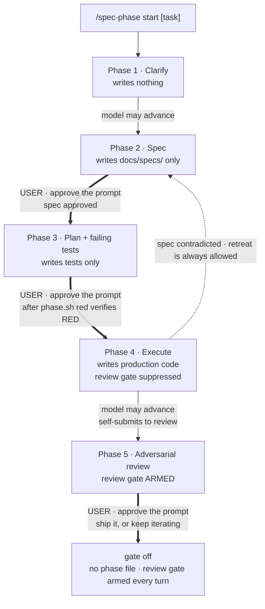
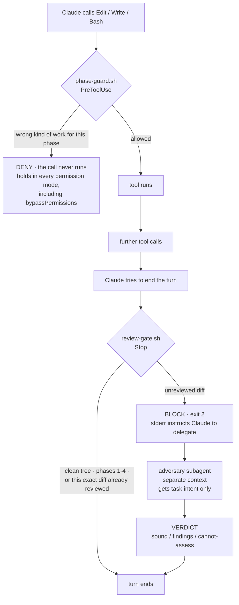

# spec-gate

A Claude Code review gate and spec-driven workflow. Two composable layers that
move oversight of AI-written code from *approving each tool call* to *reviewing
each outcome*:

1. **A review gate** — a `Stop` hook that refuses to end a turn on a diff that
   hasn't been through adversarial review, plus an `adversary` subagent that does
   the reviewing in an isolated context.
2. **A phase gate** — a `PreToolUse` hook enforcing a five-phase workflow
   (clarify → spec → plan + failing tests → execute → review), where production
   code is blocked *at the tool level* until a spec exists and the user has
   approved it.

Design premise: **prompts raise the average, hooks raise the minimum.** Anything
that must always happen is a hook. Anything needing judgment is a prompt. The
value is in knowing which is which — see [What is actually
enforced](#what-is-actually-enforced).

This directory is the source of truth for the toolkit. It is *installed into*
a separate target repo — the one whose code you want gated.

## Layout

The directory mirrors the `.claude/` layout it installs into, so the three
directories copy across recursively with no per-file renaming:

```
spec-gate/
├── README.md                        docs — not installed
├── test.sh                          regression suite — not installed
├── settings.json                    → .claude/settings.json  (MERGE, see below)
│                                    (.claude/spec-gate-test-cmd is written per
│                                     repo at install; see RED verification)
├── hooks/
│   ├── review-gate.sh               → .claude/hooks/   Stop hook
│   ├── phase-guard.sh               → .claude/hooks/   PreToolUse hook
│   ├── phase-policy.sh              → .claude/hooks/   shared policy, sourced
│   ├── phase.sh                     → .claude/hooks/   phase state CLI
│   ├── cursor-guard.sh              → .claude/hooks/   Cursor adapter
│   └── cursor-stop.sh               → .claude/hooks/   Cursor adapter
├── agents/adversary.md              → .claude/agents/
├── skills/
│   ├── spec-driven/SKILL.md         → .claude/skills/  the workflow
│   └── spec-phase/SKILL.md          → .claude/skills/  user-only phase control
└── cursor/                          for Cursor instead of / alongside Claude Code
    ├── hooks.json                   → .cursor/hooks.json
    └── agents/adversary.md          → .cursor/agents/adversary.md
```

`phase-policy.sh` is sourced by both hooks rather than executed. It holds the
one copy of what each phase permits and how the working tree is fingerprinted.
Both enforcement layers have to agree on those rules exactly; two
implementations would drift, and a gate that disagrees with itself is worse than
none. It is also the file to edit when tuning test-path patterns.

The scripts are committed with the executable bit set, so `cp -R` preserves it
and no `chmod` step is needed.

## Requirements

- A git repo. Both Stop-hook jobs fingerprint the working tree with
  `git diff HEAD`, `git status --porcelain` and `git hash-object`; outside a work
  tree the hooks exit silently.
- **Either `jq` or `python3`** — the hooks detect which is available. The
  optional `SubagentStop` review log in `settings.json` is the one jq-only piece;
  drop that block if you have neither. (`test.sh` additionally wants `python3`, to
  build hook payloads with quoting intact.)
- `bash`, not `sh`. The hooks use arrays, `<<<`, and process substitution.

## Install

Run from the root of the **target** repo:

```bash
SPEC_GATE=~/Documents/projects/AI/Skills/spec-gate   # this directory

mkdir -p .claude docs/specs
cp -R "$SPEC_GATE"/hooks "$SPEC_GATE"/agents "$SPEC_GATE"/skills .claude/
# settings.json is a MERGE, not a copy — see below.

# Teach the RED check how to run this repo's tests. Without it the 3->4 gate
# cannot be verified in-band and falls back to being terminal-only.
printf 'yarn jest $SPEC_GATE_TEST_FILES\n' > .claude/spec-gate-test-cmd

printf '.claude/.spec-phase\n.claude/.spec-baseline\n.claude/.spec-red\n.claude/review-log.jsonl\n' >> .gitignore
git add .claude .gitignore && git commit -m "add review gate + spec-driven workflow"
```

That last commit matters more than it looks. The review gate treats **untracked
files as reviewable** — correctly, since new files are usually the actual work —
so leaving `.claude/` uncommitted makes the gate fire on its own tooling.

`settings.json` needs **merging, not copying**, if the target already has one.
Two top-level keys are involved: the three event keys go inside the single
existing `hooks` object as siblings of whatever is there, and the `permissions.ask`
entry goes into any existing `permissions` object. Replacing either object
wholesale silently drops what was there.

Hooks are re-read from settings by a file watcher, so no session restart is
needed. Confirm registration with `/hooks` — all three should appear under
`PreToolUse`, `Stop`, and `SubagentStop`.

## Running under Cursor

Cursor has its own hook system (1.7+) and does not read `.claude/`, so a
Claude Code install enforces **nothing** there. It is not that the gate is weaker
in Cursor — without `.cursor/hooks.json` there is no gate at all, the phase file
is just a file the agent can rewrite, and every "enforced" claim below silently
becomes an instruction.

```bash
mkdir -p .cursor/agents
cp "$SPEC_GATE"/cursor/hooks.json .cursor/hooks.json          # MERGE if one exists
cp "$SPEC_GATE"/cursor/agents/adversary.md .cursor/agents/
```

The hook scripts stay in `.claude/hooks/`, which `.cursor/hooks.json` points at
by relative path. That looks odd in a Cursor-only repo, and it is deliberate: one
copy of the policy, referenced by both hosts. Two copies would drift.

| spec-gate layer | Claude Code | Cursor |
| --- | --- | --- |
| phase-advance gate | `PreToolUse` deny/ask | `beforeShellExecution` — same `allow`/`deny`/`ask` |
| production-write block | `PreToolUse` on Edit/Write | `preToolUse` — deny only, no `ask` |
| phase scan + review gate | `Stop`, exit 2 | `stop` → `followup_message` |
| review log | `SubagentStop` | not ported — payload field names unverified |

`cursor-guard.sh` and `cursor-stop.sh` are adapters: they translate Cursor's
payload into the Claude Code shape, run the same `phase-guard.sh` and
`review-gate.sh`, and translate the answer back. Both need `python3`.

Two places where Cursor is the better host:

- **`failClosed: true`** on a hook definition makes a script error block the
  action. That is the behaviour this project hand-rolled after finding five
  fail-open bugs; Cursor makes it a flag. Note the blast radius: on `preToolUse`
  it means a broken guard blocks *every* tool call, which is correct and also
  worth knowing before you debug something else.
- **`stop` injects the next turn** rather than refusing to end one. Claude Code's
  exit 2 can only block and hope the agent reads stderr — a model that ignores it
  ends the turn on its second attempt. Cursor hands the agent the instruction as
  a follow-up message, capped by `loop_limit` (default 5).

And one place it is worse: `preToolUse` has no `ask`, so all three approval
prompts work only because `phase.sh 3`, `phase.sh 4` and `phase.sh off` are shell
commands and reach `beforeShellExecution`. The adapter downgrades a stray `ask`
to `deny` rather than letting it evaporate.

**`readonly: false` on the Cursor adversary is deliberate.** Cursor can enforce
read-only on a subagent, which Claude Code cannot — there it is only an
instruction. Enforcement sounds strictly better and is not: the most valuable
review this reviewer has produced worked by copying the module to a scratch
directory and mutation-testing it, deleting one guard at a time to confirm
exactly one test went red. That needs writes. `readonly: true` would have
prevented the review that justified the exercise. The constraint that matters —
do not modify the files under review — is stated in the brief.

## Use

```
/spec-phase start <task>     arm the gate at Phase 1
/spec-driven <task>          run the workflow
/spec-phase status           where am I
/spec-phase red              run the Phase 3 tests, record RED if they fail
/spec-phase <1-5>            advance — the two approval gates raise a prompt
/spec-phase off              disarm
```

Each phase widens what may be written. The rule for who may advance follows
from that: **the user is required only for transitions that expand the model's
write access.** Everything else the model may do on its own, because it either
restricts itself or subjects itself to more scrutiny.



The thick edges are the decisions a hook cannot make for you: **spec approval**,
**observing RED**, and **what happens to the finished work**. All three arrive as
a confirmation prompt naming what accepting asserts.

**2→3 asks, always.** You are reading the spec in the conversation anyway, so
approving in the same place is proportionate.

**3→4 asks only once RED has been verified.** Before that the guard refuses it
however it is spelled, and the refusal says to run the check first.

**`off` from 4–5 asks.** It expands no write access at all, which is why it was
originally the model's to take freely — and that turned out to be the wrong axis
to reason on. `off` ends the task. A model that disarms on its own has decided
the work is finished and presented that as settled, skipping the only
conversation where you get to say *ship it*, *keep going*, or *throw it away*.
See [Closing out](#closing-out).

### RED verification

This is the part of the workflow that changed most, and the reasoning is worth
keeping.

The 3→4 gate used to be terminal-only. The argument was that a permission prompt
is a low-attention action — after twenty of them "yes" is a reflex — and the RED
claim was pure assertion, so a reflex click would hollow it out. Making you type
the command was the friction that kept it honest.

It had a cost nobody predicted: the check ran in **the one place the model could
not read**. The tests executed in your terminal, so the failure output — the
entire artifact Phase 3 exists to produce — never entered the conversation. The
model went into Execute knowing only that *something* had failed.

So the check and the approval are now separate acts by separate parties:

```bash
.claude/hooks/phase.sh red    # the model runs this — output lands in the transcript
.claude/hooks/phase.sh 4      # the model runs this too — you approve the prompt
```

`phase.sh red` runs the tests Phase 3 changed and **refuses if they pass**. A test
that passes before the implementation exists is testing nothing, and advancing
would carry that mistake into Execute. This converts *"trust me, they're red"*
into *"verified not-green"* — narrower than "failing for the right reason", which
stays human, but it catches the vacuous-test failure mode outright, which is the
one that actually happens.

What you approve at the prompt is the part the machine cannot check: that each
test failed for the reason the spec expects, rather than on an import error or a
typo in a fixture. You are reading real output to decide that, which is what
makes the click worth something.

**The receipt** is what stops the obvious attack. Between verification and
approval the tests could change — verify RED, then quietly edit a test green.
So `phase.sh red` writes `.claude/.spec-red` pinning the content hash of every
test file it verified, and the guard offers the prompt only while that receipt
still matches the tree. Touch a test afterwards, or add a new one, and the
receipt goes stale and 3→4 goes back to being denied. The model cannot write the
receipt itself: `.spec-red` is phase state, denied to Edit, Write and every Bash
command that names it.

Configure the check by putting a command in `.claude/spec-gate-test-cmd`. It runs
from the project root with `$SPEC_GATE_TEST_FILES` set to the test files this
phase changed, derived from the same phase-entry snapshot the Stop scan uses:

```bash
# .claude/spec-gate-test-cmd — examples
yarn jest $SPEC_GATE_TEST_FILES
pytest $SPEC_GATE_TEST_FILES
go test ./...
```

Scoped to the files one phase touched, that is usually well under a second.

| Situation | `phase.sh red` | then `phase.sh 4` |
| --- | --- | --- |
| tests fail | RED verified, receipt written | **prompts** — you approve |
| tests pass | **refused** — they are testing nothing | denied |
| no test files changed during Phase 3 | **refused** — Phase 3 exists to produce them | denied |
| tests edited after verification | — | denied, receipt stale |
| no `spec-gate-test-cmd` configured | cannot run | denied — **terminal only**, as before |

That last row is the deliberate fallback: with no test command there is nothing
to put on screen, so there is nothing to approve, and the gate reverts to
`.claude/hooks/phase.sh 4` in your own terminal. **Configuring
`spec-gate-test-cmd` is what buys the in-band prompt.**

Run from a terminal, `phase.sh 4` still behaves as it always did: it honours a
valid receipt without re-running, and runs the check itself if there is none.
Override any refusal with `phase.sh 4 --force`, which says plainly that it is
running on your assertion instead. The model cannot use it — the guard denies any
`phase.sh` command containing `--force`, in every phase.

### Closing out

Phase 5 ends when the findings are handled — the *task* ends when you say what
the work was for. Those are not the same moment, and collapsing them was a real
failure in use: the model finished its review, ran `phase.sh off`, and reported
the task as complete. Nothing was enforced wrongly. It simply answered a question
it was never asked.

So the workflow now ends with a question, and `off` is gated behind it:

> Review is done and the log is above. Open a pull request?

- **Yes** — the PR is opened, *then* the gate is disarmed.
- **No** — the gate stays on and Phase 5 continues. Further changes get reviewed
  exactly like the last ones did.

**The ordering is load-bearing, not etiquette.** `off` returns the review gate to
its default of firing every turn, and a dirty tree means review is owed — so
disarming before the work is committed leaves you tripping the gate on your own
finished diff, every turn, until you commit. Ship first, disarm second.

The prompt on `off` is the backstop; the question above is the actual mechanism.
A gate can stop the model from ending your task silently. It cannot make the
model ask you a good question first — that part is in `spec-driven`'s Phase 5,
under *instructed only*.

The full policy, enforced in `phase-guard.sh` and covered by `test.sh`:

| Transition | Who | Why |
| --- | --- | --- |
| `start` (→1) | model | most restrictive state; the workflow arms itself |
| `red` | model | verifies, advances nothing; running it is how the evidence reaches you |
| any `n` ≤ current | model | retreat, including the 4→2 contradiction path |
| 1→2 | model | phase 2 writes only `docs/specs/`; a weak Clarify surfaces at 2→3 |
| **2→3** | **user, prompt** | spec approval — the model would approve its own spec |
| **3→4, RED verified** | **user, prompt** | unlocks production code; you judge the failures on screen |
| **3→4, otherwise** | **user, terminal** | nothing verified means nothing to approve |
| 4→5 | model | self-submits to review; strictly more scrutiny |
| **forward skips** (1→3, 2→4, 2→5, 3→5…) | **user, terminal** | route around the two gates above |
| **any move off 5 except `off`** | **user, terminal** | phases 1–4 suppress the Stop gate, so this escapes a review that is owed |
| **`off` from 1–3** | **user, terminal** | equivalent to jumping to Phase 4 |
| **`off` from 4–5** | **user, prompt** | ends the task; the close-out decision is not the model's |
| **`start` while armed** | **user, terminal** | resets to Phase 1 and discards the current task |
| **`4 --force`** | **user, terminal** | advances past the RED check on assertion alone |

One asymmetry worth knowing: **`deny` holds in every permission mode, but a
hook's `ask` is not documented to survive `bypassPermissions`.** An explicit
`ask` *rule* in settings is, so `settings.json` carries one per approval gate:

```json
"permissions": { "ask": [
  "Bash(.claude/hooks/phase.sh 3*)",
  "Bash(.claude/hooks/phase.sh 4*)",
  "Bash(.claude/hooks/phase.sh off*)"
] }
```

Ask rules also beat allow rules, so this still prompts if you have `Bash`
broadly allowlisted. It matches the canonical spelling; the hook catches the
rest in normal modes. A determined bypass in bypass mode with an odd spelling is
the residual hole — stated rather than papered over, since the 3→4 gate has no
equivalent gap.

Phase state is never writable by the model in any phase: the guard denies every
Bash command that so much as names `.spec-phase`, `.spec-baseline` or
`.spec-red`, so `rm`, `mv` and redirects are all covered. Nothing legitimate
breaks, because the model reads phase state through `phase.sh status`, writes the
RED receipt through `phase.sh red`, and never touches either file directly.

With **no** phase file the Stop gate runs every turn — the intended default for
ordinary work outside the workflow. When a phase file exists, phases 1–4 suppress
the Stop gate, because the workflow owns the review checkpoint at Phase 5 and
reviewing twice costs twice.

| Layer | Event | Fires | Job |
| --- | --- | --- | --- |
| `phase-guard.sh` | `PreToolUse` | per tool call | *prevents* the wrong kind of work for the phase |
| `review-gate.sh` — phase scan | `Stop` | per turn | *catches* phase violations the guard could not see |
| `review-gate.sh` — review gate | `Stop` | per turn | blocks *ending a turn* on an unreviewed diff |
| `adversary` | subagent | on delegation | does the judging |

Write detection is deliberately split across two layers, because neither can do
the job alone:

- **Per-call interception is precise but incomplete.** For `Edit`, `Write` and
  `NotebookEdit` the path is a structured field, so the guard is exact. For
  `Bash` it has to read intent out of a command string, and no amount of regex
  makes that complete — a heredoc into a Python script will always get through.
- **The per-turn scan is complete but after the fact.** It compares the working
  tree against a snapshot taken when the phase was entered, so it sees *every*
  write regardless of mechanism. The cost is that the file is already on disk and
  has to be reverted rather than prevented.

The earlier design tried to make per-call interception authoritative, which is
why `tee`, `sed -i`, `dd`, `cp` and `mv` all slipped through it. The guard now
parses the targets it can (`tee`, `dd of=`, `cp`/`mv`/`install`/`ln`
destinations, `touch`, redirects) and refuses the write-ish forms it cannot
(`sed -i`, `perl -i`, `patch`, runtime-computed targets), pointing at Edit
instead. The scan is what makes the guarantee.

The phase-entry snapshot is what keeps the scan honest: without a baseline it
would blame the model for production files you already had dirty before Phase 3
started.

### Where the gates fire in a turn

The phase guard runs per *tool call* and can prevent a write. The review gate
runs once per *turn* and can only refuse to let the turn end. Two different
jobs, two different events:



### What the review gate ignores

The fingerprint excludes some paths outright, so they cannot move it. By default:
`docs/specs/`, plus spec-gate's own two config files unconditionally.

This is not tidiness. Two failures showed up the first time the gate ran against
a real repo, both from the fingerprint being content-blind:

- **A leftover doc kept the gate armed after the code had shipped.** The PR
  merged, the tree held one uncommitted spec document, and because a dirty tree
  means review is owed, the gate demanded adversarial review of a markdown file —
  re-firing every time the fingerprint moved.
- **Committing finished work re-armed it.** `git diff HEAD` empties out as HEAD
  moves, so the fingerprint changes even when the content is byte-identical to
  what was just reviewed. Committing triggered a fresh review of nothing, at
  roughly 100k tokens.

Both push in the same direction: toward leaving docs imprecise and commits
unmade, to avoid paying for a review cycle. That is the *"friction teaches you to
bypass the gate"* failure arriving from an unexpected angle, so the fix belongs
in the gate rather than in the habits of whoever uses it.

Specs are the right thing to exclude because they already passed a human gate at
2→3, they carry no runtime behaviour, and nothing in the adversary's brief —
concurrency, error paths, injection — has anything to say about prose.

Add to the list, one pathspec per line, in `.claude/spec-gate-review-exclude`:

```
docs/specs
src/generated
```

An empty file means nothing extra is excluded, which restores gating on specs.
The two config files stay excluded regardless: they configure the gate rather
than being work it should judge, and writing one would otherwise demand a review
of having written it. Note that `.claude/` itself is *not* excluded — commit it
at install, as above, so hook changes stay visible and reviewable.

The loop guard is `stop_hook_active`: exactly one forced pass per user turn, so
neither the scan nor the gate can spin. Fixes made in response to findings change
the diff fingerprint and get reviewed on the *following* turn rather than
shipping unexamined. The fingerprint includes content hashes of untracked files,
so rewriting a brand-new file counts as a change — which is the common case,
since new files are usually the actual work.

## What is actually enforced

`PreToolUse` hooks fire before the permission-mode check, in every mode
including `bypassPermissions`, and a deny holds regardless. Everything below is
covered by a case in `test.sh`:

- **No production code before Phase 4, and tests only in Phase 3.** Prevented
  per-call for `Edit`/`Write`/`NotebookEdit` and for the Bash write forms whose
  target can be parsed; caught per-turn by the phase scan for everything else.
- **The model cannot advance its own phase** past the two approval gates, and
  cannot touch any phase state file by any means — including the RED receipt.
  The transitions it may make either restrict it or increase scrutiny.
- **A turn cannot end on an unreviewed diff**, including one that exists only in
  untracked files, and including a *fix* to an untracked file.
- **Phase 3 cannot be left on passing tests.** `phase.sh red` runs the tests the
  phase changed and refuses if they pass; `phase.sh 4` is denied until that
  check has passed. Not a full verification of "failing for the right reason" —
  but the vacuous-test case is mechanical now, not attested.
- **A verified test cannot be edited on the way to Phase 4.** The RED receipt
  pins the content of every test file it saw fail, so verifying red and then
  quietly changing a test puts 3→4 back behind a denial.
- **The workflow cannot end silently.** `phase.sh off` prompts from phases 4–5
  and is denied outright from 1–3, so the model cannot close out a task on its
  own judgment. Whether it *asks well* before that prompt is instructed, not
  enforced.
- **Both hooks fail closed on bad state.** A corrupt phase file denies writes
  with a recovery instruction, rather than silently disabling the gate. Same for
  a missing JSON parser, or a missing `phase-policy.sh`. (`review-gate.sh` fails
  *open* if no parser exists — it cannot read the loop guard, and blocking
  without one risks spinning — but it says so on stderr rather than going quiet.)
- **A malformed denial cannot silently pass.** Reasons are stripped of the
  characters that would break hand-built JSON, because Claude Code treats
  unparseable hook output on exit 0 as "no decision" and lets the call through.

Two limits worth stating plainly, since both look like enforcement and are not:

- The Stop layer forces a *prompt*, not compliance. `stop_hook_active` means one
  block per turn, so a model that ignores the instruction can end the turn on its
  second attempt. The same is true of the scan's revert instruction.
- Phase 4 exit and Phase 5 are unenforced between each other: if the user never
  advances to 5, the diff is never gated. The user *is* the checkpoint by design.

**Instructed only** — everything in the SKILL.md bodies and the gate's block
message: showing real failure output, saying why each failure is the *expected*
one, not priming the reviewer, not padding the evidence log, stopping on
contradiction, honoring severity levels, leaving tests frozen in Phase 4, running
the repo's own validations before leaving Phase 4, and asking about the pull
request before closing out. These work most of the time and fail *silently* when
they don't.

The gate stops structural failures. It cannot stop a lazy Phase 1 or a
self-congratulatory Phase 5 log.

## Tests

```bash
./test.sh
```

Builds a throwaway git repo in a temp dir, installs the hooks into it, and drives
them with synthetic hook payloads. Nothing touches the repo you run it from.
139 cases: the phase policy, every write vector, the advance-transition matrix,
RED verification and the receipt's staleness rules, fail-closed behavior, the
review gate, and the phase scan with its baseline.

Cases tagged `[#n]` pin a bug from the review below. Those are the ones that must
never quietly come back.

## Fixed in review

A review on 2026-07-25 found twelve issues, all now closed and pinned by tests.
Recorded because the *reasons* generalise to anyone writing hooks:

1. **The model could advance its own phase.** The guard blocked writes to the
   phase file, but nothing stopped `phase.sh 4` as an ordinary Bash call. The
   root problem is that a `PreToolUse` hook cannot distinguish a call the model
   chose to make from one a slash command told it to make — so the fix was not a
   better regex but taking the two approval gates out of the model's hands.
   (Both are prompts again now that `phase.sh red` gives 3→4 something to show
   you; what stays denied is anything that would route *around* a gate.)
2. **Fixes to untracked files were never re-reviewed.** `git status --porcelain`
   lists untracked *names*, never *contents*, so rewriting a new file left the
   fingerprint unchanged. Untracked files are usually the actual work, so this
   failed exactly where it mattered most. Now `tree_snapshot` hashes contents.
3. **`tee`, `sed -i` and `dd of=` were detected, then allowed.** They matched the
   trigger regex, but extraction only ever looked for `>`, so the target came
   back empty and the call passed. Three branches that read as coverage and were
   dead. Anything that matches a write trigger must now resolve to a target or be
   denied.
4. **`cp`, `mv` and `rm` were not write forms at all.**
5. **`NotebookEdit` never reached the guard**, because a matcher of
   `Edit|Write|Bash` is an *exact* list, not a substring match.
6. **A quote in a path silently voided the deny.** Interpolating a path into
   hand-built JSON produced malformed output, and Claude Code treats unparseable
   hook output on exit 0 as "no decision" — so the gate failed open. Sanitising
   now happens inside `deny()`, covering every call site.
7. **A corrupt phase file failed open**, and crashed `phase.sh status` with an
   unbound-variable error from `NAMES[$P]` under `set -u`.
8. **Phase 4/5 could rewrite the phase file**, because the `>= 4` early exit ran
   before the phase-file protection — so at Phase 5 the model could write
   `phase=4` and suppress the review gate.
9. **The review log recorded `null`**: `settings.json` read `.subagent_type`, but
   the `SubagentStop` field is `agent_type`.
10. **`>/dev/null` was a false positive**, denying `pytest -q > /dev/null` in the
    very phase where you run tests. Fixed by scoping the gate to paths inside the
    project, which also exempts `/tmp` scratch and `~/.config` without special
    cases.
11. **`adversary` was described as read-only** while its frontmatter granted
    `Bash`. Documented honestly instead — see Caveats.
12. A newline in a task name injected a line into the state file. `head -1` meant
    it was cosmetic rather than exploitable, but the name is sanitised now.

The pattern across 1, 3, 4, 6 and 8: **each was a gate that failed open while
looking closed.** A silent fail-open is worse than no gate, because it buys
confidence it hasn't earned.

## Design decisions worth not re-litigating

- **The reviewer gets task intent only** — no summary of the implementer's
  approach, no defense of choices. A reviewer handed the author's reasoning
  mostly ratifies it. This single constraint is most of the difference between a
  gate and a rubber stamp.
- **…but the spawn prompt opens with the stance, not the task.** "Task intent
  only" was read literally at first, and produced spawn prompts like *"Message
  banners should appear below the header, not above it."* Accurate, unprimed, and
  it reads as *check that this works* — so it came back a confirmation. The brief
  in `adversary.md` says all the right things, but the spawn message is the most
  proximate instruction and it was setting a neutral frame. Both places that
  delegate now carry a fixed adversarial preamble, with the one-line intent
  dropped into it. Unprimed is about *withholding the author's reasoning*, not
  about withholding the reviewer's job.
- **"No findings" must be a normal outcome.** Both `adversary.md` and the Phase 5
  log say so explicitly. A reviewer that always finds three things trains you to
  skim; a log formatted to presume improvements gets improvements manufactured
  for it.
- **Complexity claims require Phase 1's scale figure.** Otherwise "optimize for
  time/space complexity" is an invitation to premature optimization.
- **Phase 3 requires observing RED.** Writing tests then code lets the tests be
  shaped by the implementation. Real failure output is the cheapest proof the
  test tests something.
- **The model runs the RED check; the user judges its output.** The first version
  had the user run it in a terminal, which put the failure output where the model
  could not see it — Phase 3's whole artifact, produced and then discarded. Split
  in two, each party does the half it is actually able to do.
- **Phase state on disk, not in context** — compaction eats context, and the
  model would slide from Phase 1 to Phase 4 without noticing.
- **The guard lives in `settings.json`, not skill frontmatter.** Frontmatter
  hooks are scoped to the skill's execution and torn down on exit, making
  enforcement contingent on the skill still being considered active. In settings
  it is always registered and the state file alone decides whether it bites.

## Tuning

- **Reviewer model.** `adversary.md` sets `model: opus`. It runs about once per
  turn, not per tool call, so cost is bounded but real. `sonnet` if the bill bites.
- **Per-turn review during Execute.** Phase 4 currently suppresses the Stop gate.
  Drop the `4` from the `case` list in `review-gate.sh` for incremental review at
  incremental cost.
- **Second reviewer.** Largest available quality gain: a second read-only
  subagent with a *different* brief, run in parallel — one on correctness, one on
  security or effects on callers. Copy `adversary.md`, narrow the prompt.
- **Green-suite tripwire** in `review-gate.sh` before the block, so a broken
  suite is caught deterministically rather than by a model that may not bother.
  This is the mirror of the RED tripwire above: that one refuses to *leave*
  Phase 3 while tests pass, this one refuses to end a turn while they fail.
  ```bash
  if ! <your validation command> >/dev/null 2>&1; then
    echo "REVIEW GATE: repo validations failing. Fix before ending the turn." >&2
    exit 2
  fi
  ```
  Phase 4 already *instructs* the model to work out what this repo validates a
  change with — pre-commit hook, CI, contributor docs — and to run that before
  advancing. This is the enforced version of that instruction, worth adding if
  you catch it advancing on a red lint. Point it at whatever the repo already
  defines, not at a list you maintain here; a second list is a list that drifts.
- **Scope the gate by path** if gating every diff is too aggressive:
  `git diff HEAD --name-only | grep -qE '^(src/auth|src/billing)/' || exit 0`
- **`permissions.deny` rules** are the only truly unbypassable layer — they beat
  hooks and every permission mode. Now worth adding for `phase.sh`, which the
  earlier design could not do: a deny rule would have blocked the user's own
  `/spec-phase`. With the approval gates moved to a terminal, a rule like
  `Bash(*phase.sh 3*)` has no legitimate call to break.
- **Test-path patterns** in `phase-policy.sh` should be adjusted per repo. They
  cover `tests/ test/ spec/ __tests__/`, `*_test.* *.test.* *_spec.* *.spec.*`,
  `test_*.py`, `*Test.java`, `*Tests.cs`. A false negative means production code
  slips through Phase 3, which is the one failure that makes the gate pointless.
  Both layers read them from that one file, so they cannot disagree.
- **1→2 is model-advanced** on the grounds that writing a spec is harmless and a
  thin Clarify surfaces the moment you read the spec at the 2→3 gate. To gate it
  too, add a branch calling `ask` for `PHASE=1, ARG=2` in the advance policy.
- **Where each gate sits on the ask/deny dial** is one line each in
  `phase-guard.sh`. To put 3→4 back on a terminal — worth it if you find yourself
  clicking through the prompt without reading the failures — replace the
  `red_receipt_status` case in its branch with a bare `advance_deny 4` and drop
  `Bash(.claude/hooks/phase.sh 4*)` from `permissions.ask`. `phase.sh red` keeps
  working and still puts the output in the transcript; only the approval moves.
  Same shape in reverse for making 2→3 terminal-only.
- **`spec-driven` may self-activate.** Five phases on a two-line fix is overhead,
  and that friction teaches you to bypass the gate — worse than not having it.
  Add `disable-model-invocation: true` if it fires on trivia.

## Operational notes

- **`phase.sh <n>` refuses to run before `phase.sh start`.** It errors rather
  than creating state, deliberately, so a stray command cannot arm the gate. If a
  phase advance seems not to have taken, this is why — check `phase.sh status`.
- **`phase.sh status` tells you who may make the next move**, so you do not have
  to remember the policy table.
- **2→3 arrives as a permission prompt.** Approving it is your assertion that you
  read the spec, so read it before clicking.
- **3→4 arrives as a permission prompt too, but only after `phase.sh red`.** What
  you are approving is the *reason* the tests failed, which means reading the
  output above the prompt. If the prompt appears without that output in the
  transcript, decline — something ran the check out of your sight.
- **Every phase change re-snapshots the baseline and voids the RED receipt.** If
  you deliberately want the scan to stop flagging a file you have decided to
  keep, re-entering the phase (`phase.sh 3` again) accepts the current tree as
  the new baseline — and costs you a re-run of `phase.sh red`.
- **`phase.sh off` ends the workflow, it does not stop review** — and it makes
  review fire *more* often, not less. With no phase file the Stop gate returns to
  its default of every turn, where the workflow had been suppressing it through
  phases 1–4. This surprises everyone once; `off` and `status` now both print what
  is still owed review so it surprises you visibly rather than silently. It is
  also why the close-out prompt tells you to decline while the tree is dirty —
  ship first, disarm second.
- **The way to quiet the review gate is a clean tree**, not a switch. Commit the
  work, or add the path to `spec-gate-review-exclude` if it is something the gate
  should never have been judging.

## Caveats

- **`adversary` shares a training distribution with the implementer.** Its
  independence is a separate context window and no access to the author's
  reasoning — real, but it will systematically miss what the implementer would
  systematically miss. This raises the floor; it does not replace human review on
  anything that matters.
- **`adversary` is not read-only.** Its frontmatter grants `Bash`, deliberately —
  the brief wants it to prove findings by running things rather than asserting
  them. "Do not modify any file" is an instruction, not a constraint. Drop `Bash`
  from its `tools:` list if you would rather have the guarantee than the evidence.
- **RED verification proves "not green", and nothing beyond it.** A test that
  fails on a typo, a bad import, or `assert False` satisfies the check exactly as
  well as one that fails on the behaviour it is specifying. The receipt stops the
  tests moving between the check and your approval; it has nothing to say about
  whether they were the right tests. That judgment is what the prompt is asking
  you for, and reading the output is the only way to make it.
- **Bash write detection remains best-effort by design.** A heredoc into a Python
  script, or any program that writes files as a side effect, is invisible to the
  guard. That is what the per-turn scan is for — but the scan reports after the
  write, and only once per turn.
- **The Stop layer compels a prompt, not compliance.** One block per turn means a
  model that ignores the instruction can end the turn on its second attempt.
- **No enforcement between Phase 4 exit and Phase 5.** If the user never advances,
  the diff is never gated. The user *is* the checkpoint by design.
- **Hook registration, subagent delegation, and skill auto-activation are
  unverified inside a live session.** The scripts are tested — `./test.sh`, 67
  cases — but the integration with Claude Code is not. Take one real but small
  task through end to end before trusting it.
